```python
import numpy as np
import matplotlib.pyplot as plt
import seaborn as sns
import pandas as pd
import geopandas as gpd
from tqdm import tqdm

import sklearn
import os
import duckdb
from mpl_toolkits.mplot3d import Axes3D
from scipy.stats import gaussian_kde
from scipy.stats import norm
from scipy.stats import multivariate_normal
from sklearn.model_selection import train_test_split
from sklearn.model_selection import cross_val_score

import tensorflow as tf
from keras.models import Model, Sequential
from keras.layers import Input, Dense, Layer, Dropout, BatchNormalization, LeakyReLU, Lambda, ReLU

from keras.losses import Loss, mse, MeanSquaredError
from keras.optimizers import Optimizer, Adam
from keras.regularizers import L2
from keras.metrics import Mean, MeanAbsoluteError
from keras.utils import to_categorical, plot_model, load_img, img_to_array
from keras.callbacks import EarlyStopping
from keras.models import load_model
from sklearn.metrics import mean_absolute_error, make_scorer, mean_squared_error

from sklearn.dummy import DummyRegressor

import tensorflow_probability as tfp
from tensorflow_probability import distributions as tfd

# Geospatial 
from geopy import distance
import geopandas as gpd
import pickle

np.random.seed(42)
tf.random.set_seed(42)
```

    2024-06-22 03:46:08.553039: I tensorflow/tsl/cuda/cudart_stub.cc:28] Could not find cuda drivers on your machine, GPU will not be used.
    2024-06-22 03:46:08.931077: E tensorflow/compiler/xla/stream_executor/cuda/cuda_dnn.cc:9342] Unable to register cuDNN factory: Attempting to register factory for plugin cuDNN when one has already been registered
    2024-06-22 03:46:08.931111: E tensorflow/compiler/xla/stream_executor/cuda/cuda_fft.cc:609] Unable to register cuFFT factory: Attempting to register factory for plugin cuFFT when one has already been registered
    2024-06-22 03:46:08.933239: E tensorflow/compiler/xla/stream_executor/cuda/cuda_blas.cc:1518] Unable to register cuBLAS factory: Attempting to register factory for plugin cuBLAS when one has already been registered
    2024-06-22 03:46:09.136988: I tensorflow/tsl/cuda/cudart_stub.cc:28] Could not find cuda drivers on your machine, GPU will not be used.
    2024-06-22 03:46:09.139052: I tensorflow/core/platform/cpu_feature_guard.cc:182] This TensorFlow binary is optimized to use available CPU instructions in performance-critical operations.
    To enable the following instructions: AVX2 FMA, in other operations, rebuild TensorFlow with the appropriate compiler flags.
    2024-06-22 03:46:10.441099: W tensorflow/compiler/tf2tensorrt/utils/py_utils.cc:38] TF-TRT Warning: Could not find TensorRT


# Outline

- [**Data Preparation**](#data-preparation)
    - [**Handling Some Outliers**](#handling-some-outliers)

# Data Preparation

We gonna use a bash script to automate the download of data from [NYC Trip Record Data](https://www.nyc.gov/site/tlc/about/tlc-trip-record-data.page) for yellow taxi trips in the year 2023. The bash script is the following:

```bash
# Shell exit immediately if a command exits with a error
set -e

# Args to pass when running the script
# Usage: ./download_data.sh {1} {2}
TAXI_TYPE=$1  # First argument: Taxi type ("yellow" or "green")
YEAR=$2       # Second argument: Year (e.g., 2022 or 2023)
URL_PREFIX="https://d37ci6vzurychx.cloudfront.net/trip-data"

# Loop through all months of the year
for MONTH in {1..12}; do
  # Format integers to have 2 digits for month (e.g., 01, 02)
  FMONTH=`printf "%02d" ${MONTH}`
  # Construct URL for the monthly data file
  URL="${URL_PREFIX}/${TAXI_TYPE}_tripdata_${YEAR}-${FMONTH}.parquet"

  # Define local storage path structure
  LOCAL_PREFIX="data/raw/${TAXI_TYPE}/${YEAR}/${FMONTH}"
  LOCAL_FILE="${TAXI_TYPE}_tripdata_${YEAR}_${FMONTH}.parquet"
  LOCAL_PATH="${LOCAL_PREFIX}/${LOCAL_FILE}"

  # Output the download process
  echo "downloading ${URL} to ${LOCAL_PATH}"
  # Create the specified directory and any parent directories as needed
  mkdir -p ${LOCAL_PREFIX}

  # Download the file from the URL to the specified local path
  wget ${URL} -O ${LOCAL_PATH}

done

```

Save this script file as `donwload_data.sh`. The script will create the folder `data/raw/TAXI_TYPE/YEAR/MONTH`, and in each month folder will contain a parquet file for taxi trips in NYC. Before running the script, we must make it executable:

```bash
chmod +x download_data.sh
```

The script requires two parameters: the taxi type (yellow or green) and the year. To run the script we use the following command:

```bash
./download_data.sh yellow 2023
```

We should see a three directory like the following by typing `tree data` (is necessary to install tree command: `sudo apt-get install tree`):

```
data
├── raw
│   └── yellow
│       ├── 2023
│       │   ├── 01
│       │   │   └── yellow_tripdata_2023_01.parquet
│       │   ├── 02
│       │   │   └── yellow_tripdata_2023_02.parquet
│       │   ├── 03
│       │   │   └── yellow_tripdata_2023_03.parquet
│       │   ├── 04
│       │   │   └── yellow_tripdata_2023_04.parquet
│       │   ├── 05
│       │   │   └── yellow_tripdata_2023_05.parquet
│       │   ├── 06
│       │   │   └── yellow_tripdata_2023_06.parquet
│       │   ├── 07
│       │   │   └── yellow_tripdata_2023_07.parquet
│       │   ├── 08
│       │   │   └── yellow_tripdata_2023_08.parquet
│       │   ├── 09
│       │   │   └── yellow_tripdata_2023_09.parquet
│       │   ├── 10
│       │   │   └── yellow_tripdata_2023_10.parquet
│       │   ├── 11
│       │   │   └── yellow_tripdata_2023_11.parquet
│       │   ├── 12
│       │   │   └── yellow_tripdata_2023_12.parquet
```

Another necessary dataset with the locations of each taxi pickup and dropoff is the [Taxi Zone Lookup](https://d37ci6vzurychx.cloudfront.net/misc/taxi_zone_lookup.csv) and the [Taxi Zone Shapefile](https://d37ci6vzurychx.cloudfront.net/misc/taxi_zones.zip) with the coordinates in feet. Create the folder `data/external` and download both data.

Now let's create a dataset for the taxi zone lookup with the necessary features from the shapefile using geopandas. The shape file contains information about the coordinates in feet and the taxi zone lookup the id for each zone in NYC. The final dataset will have `Zone', 'longitude' and 'latitude' as the relevant features to be used, where the longitude and latitude is the centroid location for each zone from NYC map.


```python
df_taxi_zones = pd.read_csv('data/external/taxi_zone_lookup.csv') 
df_taxi_zones = df_taxi_zones.dropna()

# Load the spatial data
gdf_zones = gpd.read_file('data/external/nyc-taxi-zones/taxi_zones.shp')

# Ensure the spatial data has a column that matches the DataFrame `LocationID` or `Zone`
# Let's assume the matching column in gdf_zones is 'zone_name'
gdf_zones = gdf_zones.rename(columns={'zone': 'Zone'})

# Compute centroids
gdf_zones['centroid'] = gdf_zones.geometry.centroid

# Extract longitude and latitude from the centroids
gdf_zones['longitude'] = gdf_zones.centroid.x
gdf_zones['latitude'] = gdf_zones.centroid.y

# Merge this back into your original DataFrame
df_taxi_zones = df_taxi_zones.merge(gdf_zones[['Zone', 'longitude', 'latitude']], on='Zone', how='left')

df_taxi_zones.to_csv("data/external/taxi_zone_lookup_feet.csv", index=False)
display(df_taxi_zones.head())
```


<div>
<style scoped>
    .dataframe tbody tr th:only-of-type {
        vertical-align: middle;
    }

    .dataframe tbody tr th {
        vertical-align: top;
    }

    .dataframe thead th {
        text-align: right;
    }
</style>
<table border="1" class="dataframe">
  <thead>
    <tr style="text-align: right;">
      <th></th>
      <th>LocationID</th>
      <th>Borough</th>
      <th>Zone</th>
      <th>service_zone</th>
      <th>longitude</th>
      <th>latitude</th>
    </tr>
  </thead>
  <tbody>
    <tr>
      <th>0</th>
      <td>1</td>
      <td>EWR</td>
      <td>Newark Airport</td>
      <td>EWR</td>
      <td>9.359968e+05</td>
      <td>191376.749531</td>
    </tr>
    <tr>
      <th>1</th>
      <td>2</td>
      <td>Queens</td>
      <td>Jamaica Bay</td>
      <td>Boro Zone</td>
      <td>1.031086e+06</td>
      <td>164018.754403</td>
    </tr>
    <tr>
      <th>2</th>
      <td>3</td>
      <td>Bronx</td>
      <td>Allerton/Pelham Gardens</td>
      <td>Boro Zone</td>
      <td>1.026453e+06</td>
      <td>254265.478659</td>
    </tr>
    <tr>
      <th>3</th>
      <td>4</td>
      <td>Manhattan</td>
      <td>Alphabet City</td>
      <td>Yellow Zone</td>
      <td>9.906340e+05</td>
      <td>202959.782391</td>
    </tr>
    <tr>
      <th>4</th>
      <td>5</td>
      <td>Staten Island</td>
      <td>Arden Heights</td>
      <td>Boro Zone</td>
      <td>9.318714e+05</td>
      <td>140681.351376</td>
    </tr>
  </tbody>
</table>
</div>


Now we can focus on the yellow taxi dataset, that contains almost 34933659 records for the year 2023. Because we have a very large number of records, instead of loading the data into pandas, I choose to use `duckdb` to handle the data by using SQL. 

We first create a database connection inside the folder `data/taxi_data.duckdb` and then create the necessary schema for the yellow taxi trip table. Then read each parquet file inside the month folders to create a single table with all the data from each month and another table with latitude and longitude from `taxi_zone_lookup_feet.csv` that was created. The result should be a table containing 34933659 records named `yellow_taxi_2023_full` and a table `taxi_zone_lookup_coord` for the coordinate zones in foots.


```python
# Connect to DuckDB
conn = duckdb.connect(database=f"data/taxi_data.duckdb", read_only=False)

# Define a schema for the table for parquet file
conn.sql("""
CREATE OR REPLACE TABLE yellow_taxi_2023_full (
VendorID INTEGER,         
tpep_pickup_datetime TIMESTAMP,
tpep_dropoff_datetime TIMESTAMP,
passenger_count FLOAT,       
trip_distance FLOAT,       
RatecodeID FLOAT,       
store_and_fwd_flag TEXT,        
PULocationID INTEGER,         
DOLocationID INTEGER,         
payment_type INTEGER,         
fare_amount FLOAT,       
extra FLOAT,       
mta_tax FLOAT,       
tip_amount FLOAT,       
tolls_amount FLOAT,       
improvement_surcharge FLOAT,       
total_amount FLOAT,       
congestion_surcharge FLOAT,       
airport_fee FLOAT 
);
""")

# table for geographical coordinates
conn.sql(
""" 
CREATE OR REPLACE TABLE taxi_zone_lookup_coord AS
    SELECT 
        LocationID,
        latitude,	
        longitude,
    FROM read_csv_auto('data/external/taxi_zone_lookup_feet.csv')
"""
)

root_dir = "data/raw/yellow/2023"
# Insert data directly into a DuckDB table from `.parquet` files
for month in sorted(os.listdir(root_dir)):
    month_path = os.path.join(root_dir, month)
    if os.path.isdir(month_path):
        for file in os.listdir(month_path):
            # concatenates the directory path with file name
            file_path = os.path.join(month_path, file)
            if file.endswith(".parquet"):
                # Using DuckDB SQL to read `.parquet` directly into a table
                conn.sql(f"""
                    COPY yellow_taxi_2023_full 
                    FROM '{file_path}' (FORMAT 'PARQUET');
                """)


conn.sql(
"""
SELECT COUNT(*) AS yellow_taxi_2023_count
FROM yellow_taxi_2023_full
""")

```


    FloatProgress(value=0.0, layout=Layout(width='auto'), style=ProgressStyle(bar_color='black'))


    FloatProgress(value=0.0, layout=Layout(width='auto'), style=ProgressStyle(bar_color='black'))


    FloatProgress(value=0.0, layout=Layout(width='auto'), style=ProgressStyle(bar_color='black'))


    FloatProgress(value=0.0, layout=Layout(width='auto'), style=ProgressStyle(bar_color='black'))


    FloatProgress(value=0.0, layout=Layout(width='auto'), style=ProgressStyle(bar_color='black'))


    FloatProgress(value=0.0, layout=Layout(width='auto'), style=ProgressStyle(bar_color='black'))


    FloatProgress(value=0.0, layout=Layout(width='auto'), style=ProgressStyle(bar_color='black'))


    ┌────────────────────────┐
    │ yellow_taxi_2023_count │
    │         int64          │
    ├────────────────────────┤
    │               38310226 │
    └────────────────────────┘


```python

conn.sql(
"""
SHOW TABLES
""")
    
```


    ┌────────────────────────┐
    │          name          │
    │        varchar         │
    ├────────────────────────┤
    │ taxi_zone_lookup_coord │
    │ yellow_taxi_2023       │
    │ yellow_taxi_2023_full  │
    └────────────────────────┘


We can see that the number of instances for each month is balanced but there is some outliers, probably inserted by mistake that needs to be removed. We can see trips for years like, for example, 2021, 2002, 2003 that don't make sense, given that the dataset contains only data from 2023:


```python
conn.sql(
"""
SELECT
    strftime('%Y-%m', tpep_pickup_datetime) AS month,
    COUNT(*) AS count
FROM yellow_taxi_2023_full
GROUP BY month
ORDER BY month
""")
```


    ┌─────────┬─────────┐
    │  month  │  count  │
    │ varchar │  int64  │
    ├─────────┼─────────┤
    │ 2001-01 │       6 │
    │ 2002-12 │      11 │
    │ 2003-01 │       6 │
    │ 2008-12 │      23 │
    │ 2009-01 │      15 │
    │ 2014-11 │       1 │
    │ 2022-10 │      11 │
    │ 2022-12 │      25 │
    │ 2023-01 │ 3066726 │
    │ 2023-02 │ 2914003 │
    │ 2023-03 │ 3403660 │
    │ 2023-04 │ 3288248 │
    │ 2023-05 │ 3513664 │
    │ 2023-06 │ 3307259 │
    │ 2023-07 │ 2907093 │
    │ 2023-08 │ 2824201 │
    │ 2023-09 │ 2846741 │
    │ 2023-10 │ 3522269 │
    │ 2023-11 │ 3339731 │
    │ 2023-12 │ 3376527 │
    │ 2024-01 │       6 │
    ├─────────┴─────────┤
    │      21 rows      │
    └───────────────────┘


Let's create a new `yellow_taxi_2023` table by selecting a random sample of 1.5 million records from the 2023 dataset, which contains more than 34.9 million records. Since the monthly data is balanced, random sampling ensures that the statistical characteristics of the entire dataset are preserved.

To add the geographic coordinates for the dropoff and pickup locations, we use the `taxi_zone_lookup_coord` table for the `PULocationID` and `DOLocationID` with an inner join. This join allows us to append the exact latitude and longitude for both the pickup and dropoff locations.

Finally, we filter the records to include only those from 2023, removing any potential outliers, and save the resulting table as a CSV file in the `data/raw/yellow/taxi_2023_raw.csv` folder.


```python
conn.sql(
"""
CREATE OR REPLACE TABLE yellow_taxi_2023 AS
SELECT
    yt2023.tpep_pickup_datetime AS pickup_datetime,
    yt2023.tpep_dropoff_datetime AS dropoff_datetime,
    pickup_zone.latitude AS pickup_latitude,
    pickup_zone.longitude AS pickup_longitude,
    dropoff_zone.latitude AS dropoff_latitude,
    dropoff_zone.longitude AS dropoff_longitude
FROM 
    (SELECT 
        tpep_pickup_datetime,
        tpep_dropoff_datetime, 
        PULocationID,
        DOLocationID,
        strftime('%Y-%m', tpep_pickup_datetime) AS month
    FROM yellow_taxi_2023_full
    WHERE strftime('%Y', tpep_pickup_datetime) = '2023'
    ORDER BY RANDOM()
    LIMIT 2000000) AS yt2023
INNER JOIN 
    taxi_zone_lookup_coord AS pickup_zone
        ON pickup_zone.LocationID = yt2023.PULocationID
INNER JOIN 
    taxi_zone_lookup_coord AS dropoff_zone
        ON dropoff_zone.LocationID = yt2023.DOLocationID;
"""
)

# Save the result table as csv file
conn.sql(
"""
SELECT * 
FROM yellow_taxi_2023
""").df().to_csv('data/raw/yellow/taxi_2023_raw.csv', index=False)
```


    FloatProgress(value=0.0, layout=Layout(width='auto'), style=ProgressStyle(bar_color='black'))


## Feature Engineering

Now that we have the dataset with just 1.5 million records and the correct pickup and dropoff coordinates for the NYC zones, it is time to create some useful features to train our neural networks. 


First, we preprocess the datetime columns to create the `min_of_day`, `day_of_week`, `day_of_year` and `trip_duration` features. The `trip_duration` will be the target variables that we aim to predict in the regression model using a simple Neural Network and a Bayesian Neural Network. The other features are the dependent variables used as input for the models. After creating these features, we remove the original datetime columns, as they are no longer needed for training the neural network


```python
df_taxi= pd.read_csv('data/raw/yellow/taxi_2023_raw.csv')
```


```python
#convert to datetime for easier manipulation
df_taxi['pickup_datetime'] = df_taxi['pickup_datetime'].str.slice(0, 16)
df_taxi['pickup_datetime'] = pd.to_datetime( df_taxi['pickup_datetime'], utc = True, format = '%Y-%m-%d %H:%M')

df_taxi['dropoff_datetime'] = df_taxi['dropoff_datetime'].str.slice(0, 16)
df_taxi['dropoff_datetime'] = pd.to_datetime( df_taxi['dropoff_datetime'], utc = True, format = '%Y-%m-%d %H:%M')

# Minutes in  a day : 0-1440
df_taxi['min_of_day'] = (60*df_taxi['pickup_datetime'].dt.hour + df_taxi['pickup_datetime'].dt.minute)
# Days in a week: 0-6, where 0 is Monday and 6 Sunday
df_taxi['day_of_week'] = df_taxi['pickup_datetime'].dt.dayofweek
# Days in a year: 1-365 (or 366)
df_taxi['day_of_year'] = df_taxi['pickup_datetime'].dt.dayofyear
# Time of the  trip
df_taxi['trip_duration'] = (df_taxi['dropoff_datetime']- df_taxi['pickup_datetime']).dt.seconds

# Remove unnecessary datetime columns
df_taxi.drop('pickup_datetime', axis = 1, inplace = True)
df_taxi.drop('dropoff_datetime', axis = 1, inplace = True)


display(df_taxi.head())
print(df_taxi.shape)
```


<div>
<style scoped>
    .dataframe tbody tr th:only-of-type {
        vertical-align: middle;
    }

    .dataframe tbody tr th {
        vertical-align: top;
    }

    .dataframe thead th {
        text-align: right;
    }
</style>
<table border="1" class="dataframe">
  <thead>
    <tr style="text-align: right;">
      <th></th>
      <th>pickup_latitude</th>
      <th>pickup_longitude</th>
      <th>dropoff_latitude</th>
      <th>dropoff_longitude</th>
      <th>min_of_day</th>
      <th>day_of_week</th>
      <th>day_of_year</th>
      <th>trip_duration</th>
    </tr>
  </thead>
  <tbody>
    <tr>
      <th>0</th>
      <td>175062.677585</td>
      <td>1.043488e+06</td>
      <td>216099.139768</td>
      <td>9.886281e+05</td>
      <td>958</td>
      <td>1</td>
      <td>304</td>
      <td>3720</td>
    </tr>
    <tr>
      <th>1</th>
      <td>213727.400082</td>
      <td>9.831375e+05</td>
      <td>175062.677585</td>
      <td>1.043488e+06</td>
      <td>637</td>
      <td>2</td>
      <td>214</td>
      <td>3300</td>
    </tr>
    <tr>
      <th>2</th>
      <td>175062.677585</td>
      <td>1.043488e+06</td>
      <td>231458.376056</td>
      <td>9.938073e+05</td>
      <td>1437</td>
      <td>5</td>
      <td>301</td>
      <td>2160</td>
    </tr>
    <tr>
      <th>3</th>
      <td>209001.626630</td>
      <td>9.868942e+05</td>
      <td>201915.790276</td>
      <td>9.851041e+05</td>
      <td>921</td>
      <td>0</td>
      <td>79</td>
      <td>540</td>
    </tr>
    <tr>
      <th>4</th>
      <td>216099.139768</td>
      <td>9.886281e+05</td>
      <td>213727.400082</td>
      <td>9.831375e+05</td>
      <td>704</td>
      <td>2</td>
      <td>165</td>
      <td>480</td>
    </tr>
  </tbody>
</table>
</div>


    (1967472, 8)


```python
# Save the dataset with new features
df_taxi.to_parquet("data/raw/yellow/taxi_2023_raw.parquet", index=False)
```

## Handling Spatial and Temporal Outliers

The boxplot for detecting outliers relies on the assumption that the data has a distribution close to normal (Gaussian), which is often not true with geospatial coordinates due to their unique patterns influenced by urban roads and traffic. Therefore, we will use a different approach to identify outliers in the location features.

For pickup and dropoff locations, the strategy is to use geospatial data using the taxi [Taxi Zone Shapefile](https://d37ci6vzurychx.cloudfront.net/misc/taxi_zones.zip) to identify with any points falls outside the boundaries of NYC map as outliers.


```python
df_taxi = pd.read_parquet('data/raw/yellow/taxi_2023_raw.parquet')
```


```python
def plot_points_map(df, gdf_map, geometry_col, ax, title='', 
                    color_map='beige', color_points='black'):
    """
    Plots a map with points from a DataFrame with coordinates.

    Parameters:
    - df: DataFrame with the coordinates to plot.
    - gdf_map: GeoDataFrame of the map boundaries.
    - geometry_col: GeoDataFrame column with geometry data.
    - ax: Matplotlib Axes object to plot on.
    - title: Title of the plot.
    - color_map: Color for the map.
    - color_points: Color for the points.
    """
    # convert to the same coordinate reference system
    gdf_points = gpd.GeoDataFrame(df, geometry=geometry_col)
    # convert to the same coordinate reference system
    gdf_points.crs = gdf_map.crs
        
    # Plot the map and the points
    gdf_map.plot(ax = ax, color=color_map, edgecolor='grey')
    gdf_points.plot(ax =ax, markersize=20, color = color_points, marker = 'x')
    ax.set_xlabel('Longitude', fontsize=14)
    ax.set_ylabel('Latitude', fontsize=14)
    ax.set_title(title, fontsize=20)

    return df
```


```python
# path of shape file
nybb_path = 'data/external/nyc-taxi-zones/taxi_zones.shp'
nyc_boundary = gpd.read_file(nybb_path)

# Creating the geometry for points
geometry = gpd.points_from_xy(df_taxi['pickup_longitude'], df_taxi['pickup_latitude'])

# Creating the plot
fig, ax = plt.subplots(figsize=(12, 12))
pickup_within_nyc = plot_points_map(    df = df_taxi, gdf_map = nyc_boundary, 
                                        geometry_col = geometry, ax = ax, title =  'Pickup Locations',
                                        color_map= '#d9cebfff', color_points= '#4759A1') 

# Showing the plot
plt.show()

```


    
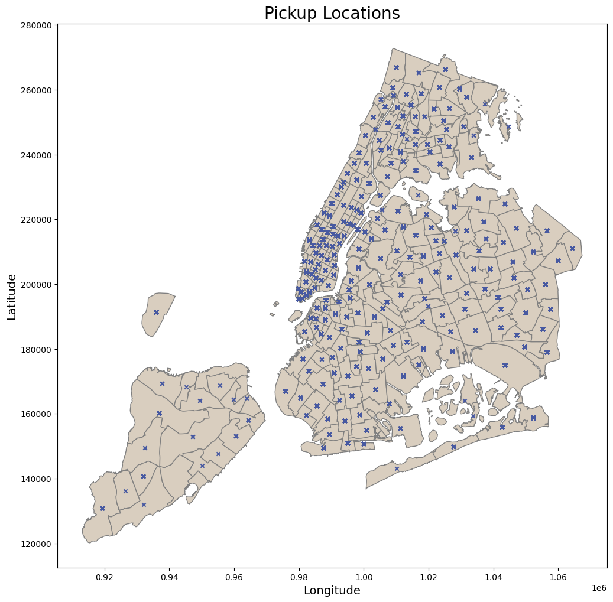
    


```python
geometry = gpd.points_from_xy(df_taxi['dropoff_longitude'], 
                                df_taxi['dropoff_latitude'])

fig, ax = plt.subplots(figsize=(12, 12))
dropoff_within_nyc = plot_points_map(    df = df_taxi, gdf_map = nyc_boundary, 
                                                geometry_col = geometry, ax = ax, title =  'Dropoff Locations',
                                                color_map= '#d9cebfff', color_points= '#4759A1')
plt.show()
```


    
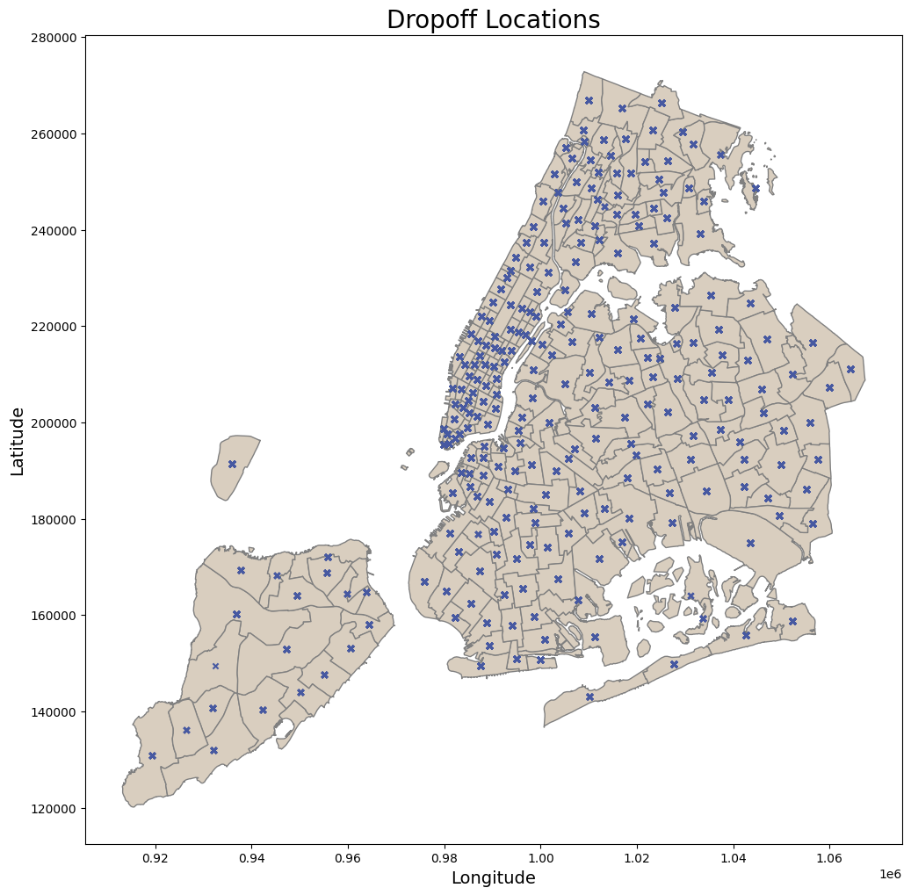
    


By checking the pickup and dropoff zones, it can be observed that all points are coherent, and there are no outliers for the locations.

To visualize the temporal outliers from trip duration, a boxplot combined with a bar plot for the distributions will be used.


```python
def boxplot_stats(series, whis = 1.5):
    """
    Calculate the statistics for a box plot.

    Returns:
    dict: A dictionary containing the quartiles, IQR, and whisker limits.
    """
    Q1 = series.quantile(0.25)
    Q2 = series.quantile(0.50)
    Q3 = series.quantile(0.75)
    IQR = Q3 - Q1

    lower_whisker = Q1 - whis * IQR
    upper_whisker = Q3 + whis * IQR

    return {
        'Q1': Q1,
        'Q2': Q2,
        'Q3': Q3,
        'IQR': IQR,
        'lower_whis': lower_whisker,
        'upper_whis': upper_whisker
    }


def plot_distribution_boxplot(  series, ax1, ax2, title='', label='', log1p=True, 
                                draw_quartiles=True, kde=True):
    """
    Plot the distribution and boxplot of a series on given axes.

    Args:
    - series (pandas.Series): The series to plot.
    - ax1 (matplotlib.axes.Axes): The axes for the histogram.
    - ax2 (matplotlib.axes.Axes): The axes for the boxplot.
    - title (str): The title of the plot.
    - label (str): The label for the x-axis.
    - log (bool): If True, applies log1p transformation to the series.
    - draw_quartiles (bool): If True, draws quartile lines on the histogram.
    - kde (bool): If True, plots a KDE over the histogram.
    """
    if log1p:
        series = np.log1p(series)
    stats = boxplot_stats(series)

    sns.histplot(   series, bins=80, linewidth=0.5, color='#dfdc7bff', alpha=0.8,
                    ax=ax1, kde=kde, line_kws={'lw': 2})
    ax1.set_title(f'{title} Histogram', fontsize=15)
    ax1.lines[0].set_color('gray')
    ax1.set_xlabel(label, fontsize=14)
    ax1.set_ylabel('Count', fontsize=14)

    sns.boxplot(data=series, color='#dfdc7bff', ax=ax2,
                fliersize=3, flierprops={'color': '#50566dff', 'markeredgecolor': '#50566dff'})
    
    ax2.set_title(f'{title} Boxplot', fontsize=15)
    ax2.set_ylabel(label, fontsize=14)

    if draw_quartiles:
        quartiles = [stats['Q1'], stats['Q3'], stats['lower_whis'], stats['upper_whis']]
        for line in quartiles:
            ax1.axvline(line, color='#50566dff', linestyle='--', alpha=1, lw=2)
            y_center = ax1.get_ylim()[1] / 2
            ax1.text(   line, y_center, f'{line:.2f}',
                        fontsize=18, color='black', va='center', ha='right', rotation=90)


```


```python
fig, (ax1, ax2) = plt.subplots(1, 2, figsize=(15, 8))
plot_distribution_boxplot(  df_taxi['trip_duration'], ax1, ax2,
                            title='Trip Duration', label='Log of Trip Duration (s)')

plt.tight_layout()
plt.show()
```


    
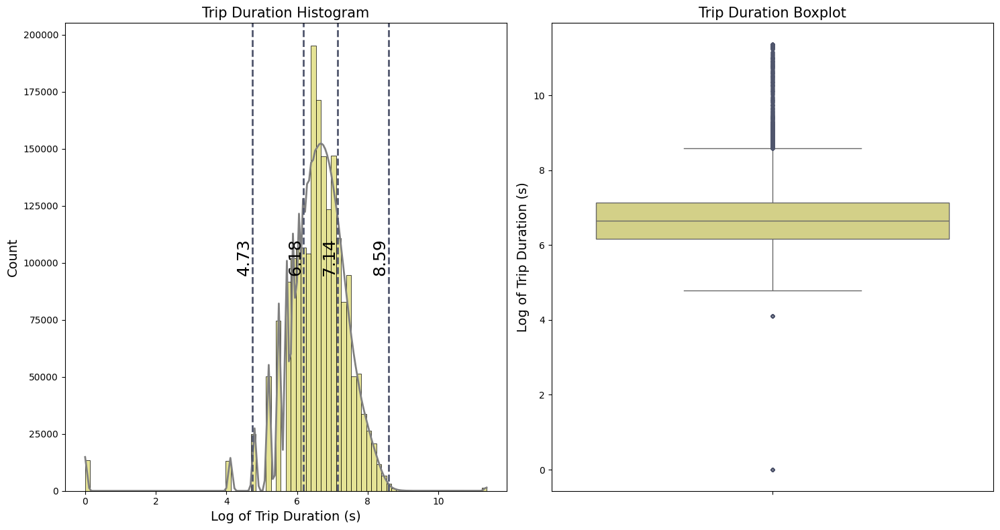
    


Because of the high values and possible zeros in the target feature `trip_duration`, we apply the logarithmic transformation $\log(x+1)$. This transformation reduces the effect of outliers and the overall variance in the dataset. Additionally, $\log(x+1)$ is particularly useful for handling zero values because the transformation ensures that zero values are transformed to zero instead of resulting in undefined values. The histogram, illustrated in the first plot, resembles a bell curve after applying this transformation. From the boxplot, we can see:

- The first and third quartiles ($Q_1$ and $Q_3$) representing the 25th and 75th percentiles, are:

  - $Q_1 = 6.18$
  - $Q_3 = 7.14$

- The interquartile range (IQR) is the difference between the third and first quartiles:
  - IQR = $Q_3 - Q_1 = 0.96$

- The whiskers indicate the range of the data:
  - The lower whisker :  $Q_1 - 1.5 IQR = 4.74$
  - The upper whisker :  $Q_3 + 1.5 IQR = 8.58$

Data points outside the whiskers are potential outliers that need further validation. For better intuition, we convert these whisker values from the log scale back to the original scale in terms of hours ($\text{Hours} = \text{Seconds}/3600$ ):

$$\frac{\exp(4.74) - 1}{3600} \approx  0.031 ~~\text{hours}$$
$$\frac{\exp(8.58) - 1}{3600} \approx  1.48 ~~\text{hours}$$

The lower whisker corresponds to approximately 1.4 minutes, which is very short for a taxi trip duration, suggesting that these could be errors or special cases like short trips to airport to carry bagge. The upper whisker suggests a more plausible trip duration of about 1.32 hours, but with very unrealistic high values with more than 20 hours of duration. 


```python
def count_outliers(series, whis = 1.5):
        """
        Count the number of upper and lower outliers in the series and print their percentages.

        Args:
        series (pd.Series): Series for which to count outliers.

        Returns:
        (pd.Series, pd.Series): Two boolean series, one for upper outliers and one for lower outliers.
        """

        stats = boxplot_stats(series, whis)


        upper_outliers = (series > stats['upper_whis'])
        lower_outliers = (series < stats['lower_whis'])

        # Percentage of outliers 
        percentage_upper = upper_outliers.sum() / len(series) * 100
        percentage_lower = lower_outliers.sum() / len(series) * 100

        print(  f'\nPotential upper outliers: {upper_outliers.sum()} '
                f'({percentage_upper:.2f}% of the dataset)')

        print(  f'\nPotential lower outliers: {lower_outliers.sum()} '
                f'({percentage_lower:.2f}% of the dataset)')

        return upper_outliers, lower_outliers


log_trip_duration = np.log1p(df_taxi['trip_duration'])
upper_duration_outliers, lower_duration_outliers = count_outliers(log_trip_duration)
```

    
    Potential upper outliers: 4695 (0.24% of the dataset)
    
    Potential lower outliers: 26676 (1.36% of the dataset)


```python
# bar plot for upper whisker
upper_outliers = df_taxi[upper_duration_outliers]['trip_duration'].reset_index(drop=True)/3600

fig, axes = plt.subplots(1, 1, figsize= (10, 5))
sns.histplot(  upper_outliers, bins=20, linewidth=0.5, color='#dfdc7bff', alpha=0.8)
axes.set_title(f'High Trip Duration Outliers', fontsize=15)
axes.set_xlabel('Trip Duration (hours)', fontsize=14)
plt.tight_layout()
plt.show()


# bar plot for lower whisker
lower_outliers = df_taxi[lower_duration_outliers]['trip_duration'].reset_index(drop=True)/3600

fig, axes = plt.subplots(1, 1, figsize= (10, 5))
sns.histplot(  lower_outliers, bins=20, linewidth=0.5, color='#dfdc7bff', alpha=0.8)
axes.set_title(f'Low Trip Duration Outliers', fontsize=15)
axes.set_xlabel('Trip Duration (hours)', fontsize=14)
plt.tight_layout()
plt.show()
```


    
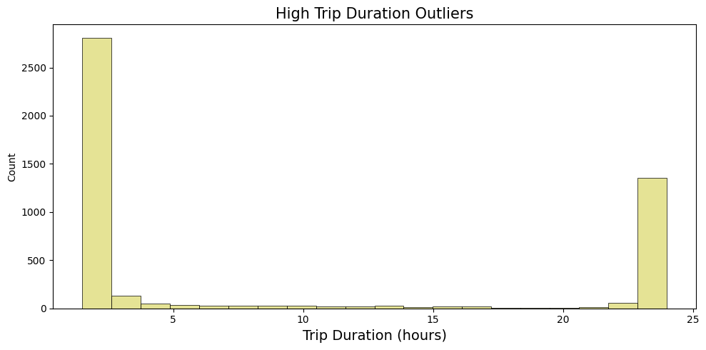
    


    
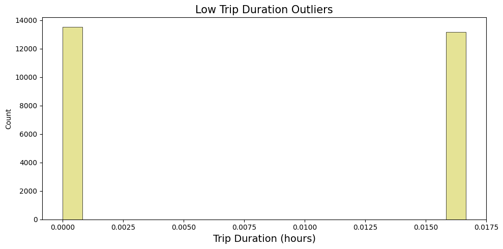
    


Based on the observation plots, it is reasonable to drop records lower then one minute and higher then 4 hours:


```python
## Select only trip duration above the lower whisker (above 1 minute)
df_taxi = df_taxi[df_taxi['trip_duration'] >= 60].copy()


## Select only trip duration lower then 4 hours
df_taxi = df_taxi[df_taxi['trip_duration'] <= 4 * 3600].copy()

df_taxi.shape
```


    (1952212, 8)


To optimize the performance of the neural network models, it is important to transform and normalize the data. Log transformation and normalization help in achieving better results by addressing skewness, reducing the impact of outliers, and ensuring that all features contribute equally to the model.

First, a logarithmic transformation is applied to the target variable `trip_duration`. Since zero values have been removed from the dataset, the standard logarithmic transformation can be safely used without encountering undefined values. Next, normalization is applied to the other dependent variables. Normalizing the data ensures that all features have a mean of 0 and a standard deviation of 1


```python
# Transform target column using log1p
df_taxi['trip_duration'] = np.log1p(df_taxi['trip_duration'])

# Normalize data for the BNN
df_taxi = (df_taxi - df_taxi.mean()) / df_taxi.std()
```

Let's check how the variables are distributed:


```python
# Adjust the layout to 3x3 to handle 9 plots
plt.figure(figsize=(15, 10))
for i in range(8):
    plt.subplot(4, 2, i + 1)  # Create a 3x3 grid
    sns.histplot(df_taxi.iloc[:, i], bins=15, linewidth=1, color='#dfdc7bff', alpha=0.8)
    plt.title(df_taxi.columns[i], fontsize=15)
plt.tight_layout()
plt.show()
```


    
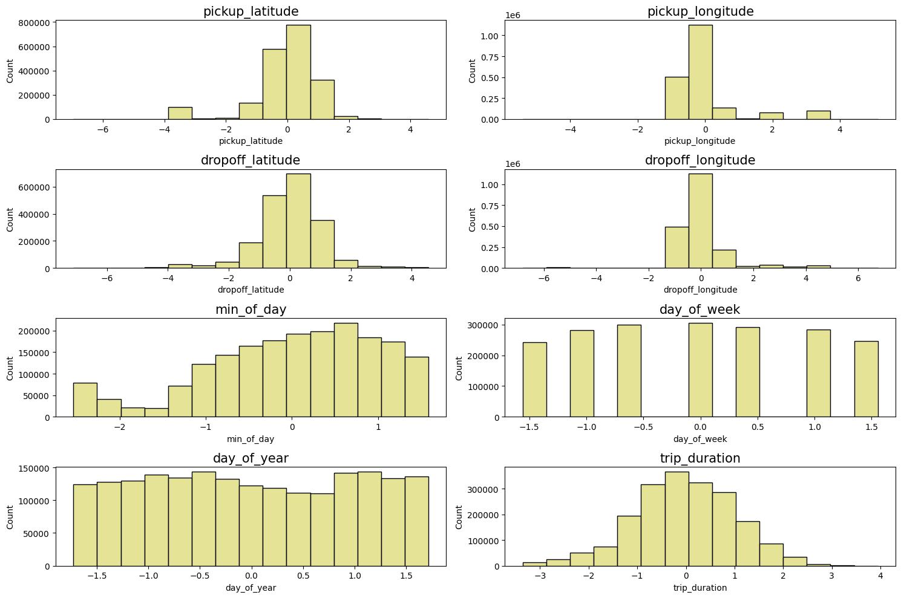
    


The final dataset can be then saved into the `data/processed/yellow_taxi_2023.parquet` folder. This will be the data used to train our regression model to predict the yellow taxi trip duration in NYC.


```python
df_taxi.to_parquet("data/processed/yellow_taxi_2023.parquet", index=False)
```

# Simple Neural Network


```python
# Load the processed data
df_taxi = pd.read_parquet("data/processed/yellow_taxi_2023.parquet")

# Split the data into train, validation adn test
df_train_large, df_taxi_test = train_test_split(df_taxi, test_size = 0.20, random_state=42 )
df_taxi_train, df_taxi_val = train_test_split(df_train_large, train_size = 0.25, random_state=42)


print(f"Train large:{len(df_train_large)}({round(100*len(df_train_large)/ len(df_taxi), 2)}%)")
print(f"Test: {len(df_taxi_test)}({round(100*len(df_taxi_test)/len(df_taxi),2)}%)")
print(f"Train:{len(df_taxi_train)}({round(100*len(df_taxi_train)/len(df_taxi),2)}%)")
print(f"Validation: {len(df_taxi_val)}({round(100*len(df_taxi_val)/len(df_taxi),2)}%)")

# Save Target feature
Y_train = df_taxi_train['trip_duration'].values
Y_val = df_taxi_val['trip_duration'].values
Y_test = df_taxi_test['trip_duration'].values

# Drop target feature
df_taxi_train.drop('trip_duration', axis=1, inplace=True)
df_taxi_val.drop('trip_duration', axis=1, inplace=True)
df_taxi_test.drop('trip_duration', axis=1, inplace=True)

X_train = df_taxi_train.values
X_val = df_taxi_val.values
X_test = df_taxi_test.values
```

    Train large:1561769(80.0%)
    Test: 390443(20.0%)
    Train:390442(20.0%)
    Validation: 1171327(60.0%)


```python
class NNRegressor(Model):
    def __init__(self,
                 layer_units: list = [1024, 512, 128, 64],
                 output_unit: int = 1,
                 dropout_rate: float = 0.1,
                 name="NNRegressor"):
        """
        Initialize the NNRegressor.

        Args:
            layer_units (list of int): A list of integers representing the number of units in each hidden layer.
            output_unit (int): An integer representing the number of units in the output layer.
            dropout_rate (float): A float representing the dropout rate used in each dropout layer.
            name (str): A string representing the name of the model.
        """
        super().__init__(name=name)

        self.units = layer_units
        self.output_unit = output_unit
        self.dropout_rate = dropout_rate

        # Hidden layers
        self.hidden_layers = []
        for i, unit in enumerate(layer_units):
            self.hidden_layers.append(Dense(units=unit,                                          
                                           use_bias=True,
                                           name=f'Hidden_{i}'))
            self.hidden_layers.append(BatchNormalization(name=f'BatchNorm_{i}'))
            self.hidden_layers.append(ReLU(name=f'ReLU_{i}'))
            self.hidden_layers.append(Dropout(dropout_rate, name=f'Dropout_{i}'))

        # Output layer
        self.output_layer = Dense(units=output_unit,
                                  name="Output")

    def call(self, x):
        """
        Compute the forward pass of the NNRegressor.

        Args:
            x (tf.Tensor): A tensor of shape (batch_size, input_dim), where input_dim is the dimension of the input features.

        Returns:
            tf.Tensor: A tensor of shape (batch_size, output_unit), containing the output of the NNRegressor.
        """

        for layer in self.hidden_layers:
            x = layer(x)
        x = self.output_layer(x)

        return x

```


```python
# Instantiate and compile the model
nn_regressor = NNRegressor()
nn_regressor.compile(optimizer=Adam(learning_rate=1e-4), loss='mean_absolute_error')

# Train the model with explicit validation data
nn_history = nn_regressor.fit(X_train, Y_train, batch_size=1024, epochs=150, validation_data=(X_val, Y_val), verbose=1)

# Save Model
current_directory = os.getcwd()
save_dir = os.path.expanduser( current_directory + '/models/nn_regressor')
nn_regressor.save(save_dir)
```

    Epoch 1/150
    382/382 [==============================] - 19s 47ms/step - loss: 0.5925 - val_loss: 0.4669
    Epoch 2/150
    382/382 [==============================] - 18s 47ms/step - loss: 0.4891 - val_loss: 0.4025
    Epoch 3/150
    382/382 [==============================] - 18s 46ms/step - loss: 0.4642 - val_loss: 0.3991
    Epoch 4/150
    382/382 [==============================] - 18s 46ms/step - loss: 0.4498 - val_loss: 0.3940
    Epoch 5/150
    382/382 [==============================] - 18s 46ms/step - loss: 0.4402 - val_loss: 0.3911
    Epoch 6/150
    382/382 [==============================] - 18s 46ms/step - loss: 0.4337 - val_loss: 0.3899
    Epoch 7/150
    382/382 [==============================] - 18s 46ms/step - loss: 0.4266 - val_loss: 0.3878
    Epoch 8/150
    382/382 [==============================] - 18s 46ms/step - loss: 0.4218 - val_loss: 0.3861
    Epoch 9/150
    382/382 [==============================] - 18s 46ms/step - loss: 0.4173 - val_loss: 0.3851
    Epoch 10/150
    382/382 [==============================] - 18s 46ms/step - loss: 0.4142 - val_loss: 0.3841
    Epoch 11/150
    382/382 [==============================] - 18s 46ms/step - loss: 0.4114 - val_loss: 0.3824
    Epoch 12/150
    382/382 [==============================] - 18s 46ms/step - loss: 0.4086 - val_loss: 0.3823
    Epoch 13/150
    382/382 [==============================] - 18s 46ms/step - loss: 0.4067 - val_loss: 0.3814
    Epoch 14/150
    382/382 [==============================] - 18s 46ms/step - loss: 0.4046 - val_loss: 0.3814
    Epoch 15/150
    382/382 [==============================] - 18s 46ms/step - loss: 0.4028 - val_loss: 0.3802
    Epoch 16/150
    382/382 [==============================] - 20s 51ms/step - loss: 0.4013 - val_loss: 0.3790
    Epoch 17/150
    382/382 [==============================] - 19s 50ms/step - loss: 0.3998 - val_loss: 0.3795
    Epoch 18/150
    382/382 [==============================] - 23s 60ms/step - loss: 0.3987 - val_loss: 0.3780
    Epoch 19/150
    382/382 [==============================] - 24s 62ms/step - loss: 0.3979 - val_loss: 0.3788
    Epoch 20/150
    382/382 [==============================] - 21s 55ms/step - loss: 0.3969 - val_loss: 0.3773
    Epoch 21/150
    382/382 [==============================] - 21s 56ms/step - loss: 0.3956 - val_loss: 0.3765
    Epoch 22/150
    382/382 [==============================] - 22s 59ms/step - loss: 0.3952 - val_loss: 0.3771
    Epoch 23/150
    382/382 [==============================] - 22s 56ms/step - loss: 0.3946 - val_loss: 0.3757
    Epoch 24/150
    382/382 [==============================] - 21s 55ms/step - loss: 0.3938 - val_loss: 0.3751
    Epoch 25/150
    382/382 [==============================] - 21s 56ms/step - loss: 0.3933 - val_loss: 0.3749
    Epoch 26/150
    382/382 [==============================] - 21s 54ms/step - loss: 0.3926 - val_loss: 0.3763
    Epoch 27/150
    382/382 [==============================] - 21s 55ms/step - loss: 0.3917 - val_loss: 0.3747
    Epoch 28/150
    382/382 [==============================] - 21s 56ms/step - loss: 0.3914 - val_loss: 0.3739
    Epoch 29/150
    382/382 [==============================] - 21s 55ms/step - loss: 0.3910 - val_loss: 0.3738
    Epoch 30/150
    382/382 [==============================] - 21s 56ms/step - loss: 0.3905 - val_loss: 0.3746
    Epoch 31/150
    382/382 [==============================] - 21s 56ms/step - loss: 0.3902 - val_loss: 0.3729
    Epoch 32/150
    382/382 [==============================] - 22s 57ms/step - loss: 0.3890 - val_loss: 0.3734
    Epoch 33/150
    382/382 [==============================] - 22s 58ms/step - loss: 0.3889 - val_loss: 0.3733
    Epoch 34/150
    382/382 [==============================] - 25s 65ms/step - loss: 0.3880 - val_loss: 0.3728
    Epoch 35/150
    382/382 [==============================] - 25s 64ms/step - loss: 0.3882 - val_loss: 0.3736
    Epoch 36/150
    382/382 [==============================] - 25s 66ms/step - loss: 0.3876 - val_loss: 0.3730
    Epoch 37/150
    382/382 [==============================] - 24s 63ms/step - loss: 0.3877 - val_loss: 0.3730
    Epoch 38/150
    382/382 [==============================] - 25s 64ms/step - loss: 0.3871 - val_loss: 0.3723
    Epoch 39/150
    382/382 [==============================] - 24s 64ms/step - loss: 0.3871 - val_loss: 0.3723
    Epoch 40/150
    382/382 [==============================] - 21s 56ms/step - loss: 0.3868 - val_loss: 0.3712
    Epoch 41/150
    382/382 [==============================] - 21s 55ms/step - loss: 0.3865 - val_loss: 0.3714
    Epoch 42/150
    382/382 [==============================] - 21s 55ms/step - loss: 0.3863 - val_loss: 0.3714
    Epoch 43/150
    382/382 [==============================] - 21s 56ms/step - loss: 0.3858 - val_loss: 0.3707
    Epoch 44/150
    382/382 [==============================] - 21s 56ms/step - loss: 0.3852 - val_loss: 0.3707
    Epoch 45/150
    382/382 [==============================] - 21s 56ms/step - loss: 0.3851 - val_loss: 0.3719
    Epoch 46/150
    382/382 [==============================] - 21s 55ms/step - loss: 0.3850 - val_loss: 0.3708
    Epoch 47/150
    382/382 [==============================] - 21s 55ms/step - loss: 0.3853 - val_loss: 0.3707
    Epoch 48/150
    382/382 [==============================] - 21s 55ms/step - loss: 0.3843 - val_loss: 0.3702
    Epoch 49/150
    382/382 [==============================] - 21s 54ms/step - loss: 0.3841 - val_loss: 0.3704
    Epoch 50/150
    382/382 [==============================] - 21s 54ms/step - loss: 0.3843 - val_loss: 0.3702
    Epoch 51/150
    382/382 [==============================] - 21s 55ms/step - loss: 0.3837 - val_loss: 0.3697
    Epoch 52/150
    382/382 [==============================] - 21s 55ms/step - loss: 0.3835 - val_loss: 0.3703
    Epoch 53/150
    382/382 [==============================] - 21s 54ms/step - loss: 0.3833 - val_loss: 0.3697
    Epoch 54/150
    382/382 [==============================] - 21s 55ms/step - loss: 0.3829 - val_loss: 0.3695
    Epoch 55/150
    382/382 [==============================] - 21s 55ms/step - loss: 0.3829 - val_loss: 0.3691
    Epoch 56/150
    382/382 [==============================] - 21s 54ms/step - loss: 0.3830 - val_loss: 0.3696
    Epoch 57/150
    382/382 [==============================] - 21s 55ms/step - loss: 0.3824 - val_loss: 0.3696
    Epoch 58/150
    382/382 [==============================] - 21s 55ms/step - loss: 0.3824 - val_loss: 0.3688
    Epoch 59/150
    382/382 [==============================] - 21s 55ms/step - loss: 0.3821 - val_loss: 0.3692
    Epoch 60/150
    382/382 [==============================] - 21s 55ms/step - loss: 0.3821 - val_loss: 0.3687
    Epoch 61/150
    382/382 [==============================] - 21s 56ms/step - loss: 0.3820 - val_loss: 0.3686
    Epoch 62/150
    382/382 [==============================] - 21s 56ms/step - loss: 0.3819 - val_loss: 0.3687
    Epoch 63/150
    382/382 [==============================] - 21s 56ms/step - loss: 0.3818 - val_loss: 0.3698
    Epoch 64/150
    382/382 [==============================] - 21s 55ms/step - loss: 0.3815 - val_loss: 0.3700
    Epoch 65/150
    382/382 [==============================] - 21s 54ms/step - loss: 0.3812 - val_loss: 0.3689
    Epoch 66/150
    382/382 [==============================] - 20s 53ms/step - loss: 0.3811 - val_loss: 0.3698
    Epoch 67/150
    382/382 [==============================] - 21s 54ms/step - loss: 0.3805 - val_loss: 0.3683
    Epoch 68/150
    382/382 [==============================] - 21s 55ms/step - loss: 0.3810 - val_loss: 0.3691
    Epoch 69/150
    382/382 [==============================] - 20s 53ms/step - loss: 0.3808 - val_loss: 0.3696
    Epoch 70/150
    382/382 [==============================] - 21s 54ms/step - loss: 0.3805 - val_loss: 0.3681
    Epoch 71/150
    382/382 [==============================] - 21s 54ms/step - loss: 0.3803 - val_loss: 0.3692
    Epoch 72/150
    382/382 [==============================] - 21s 56ms/step - loss: 0.3803 - val_loss: 0.3682
    Epoch 73/150
    382/382 [==============================] - 21s 55ms/step - loss: 0.3804 - val_loss: 0.3679
    Epoch 74/150
    382/382 [==============================] - 21s 55ms/step - loss: 0.3802 - val_loss: 0.3676
    Epoch 75/150
    382/382 [==============================] - 21s 55ms/step - loss: 0.3798 - val_loss: 0.3674
    Epoch 76/150
    382/382 [==============================] - 21s 55ms/step - loss: 0.3800 - val_loss: 0.3684
    Epoch 77/150
    382/382 [==============================] - 21s 54ms/step - loss: 0.3796 - val_loss: 0.3675
    Epoch 78/150
    382/382 [==============================] - 21s 55ms/step - loss: 0.3793 - val_loss: 0.3675
    Epoch 79/150
    382/382 [==============================] - 21s 55ms/step - loss: 0.3796 - val_loss: 0.3674
    Epoch 80/150
    382/382 [==============================] - 21s 55ms/step - loss: 0.3790 - val_loss: 0.3672
    Epoch 81/150
    382/382 [==============================] - 21s 54ms/step - loss: 0.3789 - val_loss: 0.3669
    Epoch 82/150
    382/382 [==============================] - 21s 55ms/step - loss: 0.3788 - val_loss: 0.3675
    Epoch 83/150
    382/382 [==============================] - 21s 55ms/step - loss: 0.3791 - val_loss: 0.3676
    Epoch 84/150
    382/382 [==============================] - 21s 54ms/step - loss: 0.3784 - val_loss: 0.3670
    Epoch 85/150
    382/382 [==============================] - 21s 55ms/step - loss: 0.3783 - val_loss: 0.3666
    Epoch 86/150
    382/382 [==============================] - 21s 56ms/step - loss: 0.3786 - val_loss: 0.3688
    Epoch 87/150
    382/382 [==============================] - 21s 55ms/step - loss: 0.3785 - val_loss: 0.3668
    Epoch 88/150
    382/382 [==============================] - 21s 55ms/step - loss: 0.3781 - val_loss: 0.3668
    Epoch 89/150
    382/382 [==============================] - 21s 55ms/step - loss: 0.3776 - val_loss: 0.3665
    Epoch 90/150
    382/382 [==============================] - 21s 55ms/step - loss: 0.3779 - val_loss: 0.3669
    Epoch 91/150
    382/382 [==============================] - 21s 55ms/step - loss: 0.3777 - val_loss: 0.3670
    Epoch 92/150
    382/382 [==============================] - 21s 55ms/step - loss: 0.3783 - val_loss: 0.3666
    Epoch 93/150
    382/382 [==============================] - 21s 56ms/step - loss: 0.3776 - val_loss: 0.3663
    Epoch 94/150
    382/382 [==============================] - 21s 55ms/step - loss: 0.3775 - val_loss: 0.3666
    Epoch 95/150
    382/382 [==============================] - 21s 54ms/step - loss: 0.3778 - val_loss: 0.3662
    Epoch 96/150
    382/382 [==============================] - 21s 55ms/step - loss: 0.3776 - val_loss: 0.3666
    Epoch 97/150
    382/382 [==============================] - 21s 54ms/step - loss: 0.3773 - val_loss: 0.3667
    Epoch 98/150
    382/382 [==============================] - 21s 54ms/step - loss: 0.3770 - val_loss: 0.3663
    Epoch 99/150
    382/382 [==============================] - 21s 55ms/step - loss: 0.3765 - val_loss: 0.3664
    Epoch 100/150
    382/382 [==============================] - 21s 56ms/step - loss: 0.3767 - val_loss: 0.3664
    Epoch 101/150
    382/382 [==============================] - 21s 56ms/step - loss: 0.3768 - val_loss: 0.3662
    Epoch 102/150
    382/382 [==============================] - 21s 55ms/step - loss: 0.3768 - val_loss: 0.3664
    Epoch 103/150
    382/382 [==============================] - 21s 55ms/step - loss: 0.3766 - val_loss: 0.3660
    Epoch 104/150
    382/382 [==============================] - 21s 56ms/step - loss: 0.3765 - val_loss: 0.3667
    Epoch 105/150
    382/382 [==============================] - 21s 54ms/step - loss: 0.3763 - val_loss: 0.3658
    Epoch 106/150
    382/382 [==============================] - 21s 55ms/step - loss: 0.3762 - val_loss: 0.3659
    Epoch 107/150
    382/382 [==============================] - 21s 55ms/step - loss: 0.3763 - val_loss: 0.3656
    Epoch 108/150
    382/382 [==============================] - 21s 55ms/step - loss: 0.3763 - val_loss: 0.3655
    Epoch 109/150
    382/382 [==============================] - 21s 55ms/step - loss: 0.3763 - val_loss: 0.3661
    Epoch 110/150
    382/382 [==============================] - 21s 56ms/step - loss: 0.3761 - val_loss: 0.3653
    Epoch 111/150
    382/382 [==============================] - 21s 55ms/step - loss: 0.3763 - val_loss: 0.3664
    Epoch 112/150
    382/382 [==============================] - 21s 54ms/step - loss: 0.3761 - val_loss: 0.3655
    Epoch 113/150
    382/382 [==============================] - 21s 55ms/step - loss: 0.3760 - val_loss: 0.3660
    Epoch 114/150
    382/382 [==============================] - 21s 56ms/step - loss: 0.3757 - val_loss: 0.3651
    Epoch 115/150
    382/382 [==============================] - 21s 54ms/step - loss: 0.3756 - val_loss: 0.3657
    Epoch 116/150
    382/382 [==============================] - 21s 55ms/step - loss: 0.3756 - val_loss: 0.3675
    Epoch 117/150
    382/382 [==============================] - 21s 55ms/step - loss: 0.3755 - val_loss: 0.3656
    Epoch 118/150
    382/382 [==============================] - 21s 55ms/step - loss: 0.3754 - val_loss: 0.3657
    Epoch 119/150
    382/382 [==============================] - 21s 56ms/step - loss: 0.3755 - val_loss: 0.3658
    Epoch 120/150
    382/382 [==============================] - 21s 56ms/step - loss: 0.3753 - val_loss: 0.3650
    Epoch 121/150
    382/382 [==============================] - 21s 55ms/step - loss: 0.3751 - val_loss: 0.3654
    Epoch 122/150
    382/382 [==============================] - 21s 55ms/step - loss: 0.3751 - val_loss: 0.3655
    Epoch 123/150
    382/382 [==============================] - 21s 55ms/step - loss: 0.3753 - val_loss: 0.3661
    Epoch 124/150
    382/382 [==============================] - 21s 55ms/step - loss: 0.3751 - val_loss: 0.3662
    Epoch 125/150
    382/382 [==============================] - 21s 55ms/step - loss: 0.3750 - val_loss: 0.3648
    Epoch 126/150
    382/382 [==============================] - 21s 55ms/step - loss: 0.3750 - val_loss: 0.3648
    Epoch 127/150
    382/382 [==============================] - 21s 56ms/step - loss: 0.3749 - val_loss: 0.3651
    Epoch 128/150
    382/382 [==============================] - 21s 55ms/step - loss: 0.3747 - val_loss: 0.3662
    Epoch 129/150
    382/382 [==============================] - 21s 55ms/step - loss: 0.3746 - val_loss: 0.3650
    Epoch 130/150
    382/382 [==============================] - 21s 54ms/step - loss: 0.3745 - val_loss: 0.3648
    Epoch 131/150
    382/382 [==============================] - 21s 55ms/step - loss: 0.3744 - val_loss: 0.3652
    Epoch 132/150
    382/382 [==============================] - 21s 56ms/step - loss: 0.3742 - val_loss: 0.3646
    Epoch 133/150
    382/382 [==============================] - 19s 49ms/step - loss: 0.3744 - val_loss: 0.3648
    Epoch 134/150
    382/382 [==============================] - 18s 46ms/step - loss: 0.3739 - val_loss: 0.3647
    Epoch 135/150
    382/382 [==============================] - 18s 46ms/step - loss: 0.3740 - val_loss: 0.3643
    Epoch 136/150
    382/382 [==============================] - 18s 46ms/step - loss: 0.3739 - val_loss: 0.3642
    Epoch 137/150
    382/382 [==============================] - 18s 46ms/step - loss: 0.3739 - val_loss: 0.3646
    Epoch 138/150
    382/382 [==============================] - 18s 46ms/step - loss: 0.3739 - val_loss: 0.3646
    Epoch 139/150
    382/382 [==============================] - 18s 47ms/step - loss: 0.3738 - val_loss: 0.3644
    Epoch 140/150
    382/382 [==============================] - 18s 46ms/step - loss: 0.3743 - val_loss: 0.3644
    Epoch 141/150
    382/382 [==============================] - 18s 47ms/step - loss: 0.3735 - val_loss: 0.3645
    Epoch 142/150
    382/382 [==============================] - 18s 46ms/step - loss: 0.3740 - val_loss: 0.3650
    Epoch 143/150
    382/382 [==============================] - 18s 46ms/step - loss: 0.3739 - val_loss: 0.3645
    Epoch 144/150
    382/382 [==============================] - 17s 45ms/step - loss: 0.3735 - val_loss: 0.3643
    Epoch 145/150
    382/382 [==============================] - 17s 45ms/step - loss: 0.3733 - val_loss: 0.3637
    Epoch 146/150
    382/382 [==============================] - 17s 46ms/step - loss: 0.3736 - val_loss: 0.3647
    Epoch 147/150
    382/382 [==============================] - 17s 46ms/step - loss: 0.3732 - val_loss: 0.3640
    Epoch 148/150
    382/382 [==============================] - 17s 46ms/step - loss: 0.3732 - val_loss: 0.3645
    Epoch 149/150
    382/382 [==============================] - 18s 46ms/step - loss: 0.3728 - val_loss: 0.3644
    Epoch 150/150
    382/382 [==============================] - 18s 46ms/step - loss: 0.3729 - val_loss: 0.3643
    INFO:tensorflow:Assets written to: /home/marcos/GitHub/bayesian-neural-network/02-regression/models/nn_regressor/assets


    INFO:tensorflow:Assets written to: /home/marcos/GitHub/bayesian-neural-network/02-regression/models/nn_regressor/assets


```python
plt.plot(nn_history.history['loss'], label='Train', color =  'black')
plt.plot(nn_history.history['val_loss'], label='Validation', color =  "#d08f10ff" )
plt.title('MAE vs Epochs')
plt.legend()
plt.xlabel('Epoch')
plt.ylabel('MAE')
plt.grid()
plt.show()

```


    
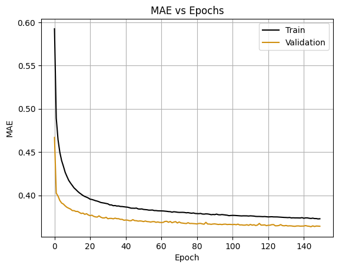
    


```python
train_mae_log = 0.38
val_mae_log = 0.37

train_mae_original = np.exp(train_mae_log)
val_mae_original = np.exp(val_mae_log)

print(f"Original scale train MAE: {train_mae_original:.2f} seconds")
print(f"Original scale validation MAE: {val_mae_original:.2f} seconds")

```

    Original scale train MAE: 1.46 seconds
    Original scale validation MAE: 1.45 seconds


After back-transforming the MAE values from the log scale, the results indicate that the predictions deviate from the actual values by a factor of approximately 1.47 for the training set and 1.45 for the validation set. This is because the log transformation turns multiplicative errors into additive ones. When exponentiating the log-scale MAE, it reflects the average multiplicative error. For an actual trip duration of 500 seconds, this means:

- Train MAE: The predictions would be off by a factor of 1.47. Therefore, $1.47 \times 500≈7351.47  \times 500≈735$ seconds.

- Validation MAE: The predictions would be off by a factor of 1.45. Therefore, $1.45 \times 500≈7251.45  \times 500≈725$ seconds.


```python
# Make predictions on the test set
preds = nn_regressor.predict(X_test)

# Select a sample of predictions to plot
sample_indices = np.random.choice(range(len(Y_test)), size=9, replace=False)
sample_preds = preds[sample_indices]
sample_true = Y_test[sample_indices]

# Plot true vs predicted durations
plt.figure(figsize=(15, 10)) 
for i in range(9):
    plt.subplot(3, 3, i + 1)  # 3 rows, 3 columns
    plt.axvline(sample_preds[i], label='Predicted', color='#dfdc7bff', linewidth=3)
    plt.axvline(sample_true[i], ls=':', color='black', label='True', linewidth=3)
    plt.xlim([-5, 5])
    plt.legend()
    plt.gca().get_yaxis().set_ticklabels([])
    plt.grid()
    if i < 6:
        plt.gca().get_xaxis().set_ticklabels([])

plt.tight_layout()
plt.show()
```

    12202/12202 [==============================] - 14s 1ms/step


    
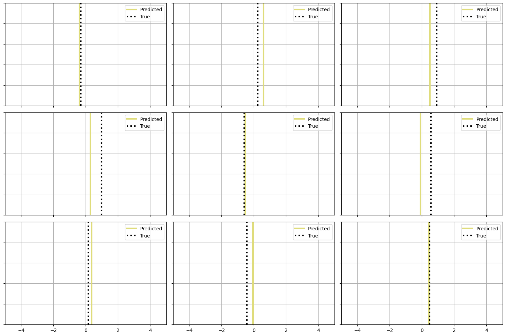
    


The provided plot shows a comparison between predicted and true trip durations for a sample of 9 trips from the test set. Each subplot represents a single trip, showing the predicted duration as a solid line and the true duration as a dashed line.

Neural networks typically provide point estimates for predictions, meaning they output a single predicted value for each input. Point estimates do not provide information about the uncertainty or confidence in the predictions. This is a significant limitation because it means we can't quantify how confident the model is about its predictions.

For example, in a taxi trip, knowing the uncertainty in trip duration helps passengers plan their activities better. For example, ff a passenger has a flight to catch, understanding the potential range of travel times can help them decide when to leave for the airport.


```python
nn_preds = nn_regressor.predict(X_test)

# distributions plot
plt.figure(figsize=(16, 6))

# KDE plot for residuals
plt.subplot(1, 2, 1)
sns.kdeplot(Y_test, fill=True, color="#dfdc7bff" , alpha=0.5, label='True')
sns.kdeplot(nn_preds, fill=True, color="#d08f10ff",  label='Predicted')
plt.legend()
plt.ylabel('Density')
plt.title('Distribution (KDE)')
plt.grid()
plt.xlim(-2, 2)

# CDF plot
plt.subplot(1, 2, 2)
sns.kdeplot(Y_test, cumulative=True, color="#dfdc7bff", linewidth=2, label='True')
sns.kdeplot(nn_preds, cumulative=True, color="#d08f10ff", linewidth=2,  label='Predicted')
plt.legend()
plt.ylabel('CDF')
plt.title('Cumulative Distribution (CDF)')
plt.grid()
plt.xlim(-2, 2)

plt.tight_layout()
plt.show()
```

    12202/12202 [==============================] - 22s 2ms/step


    
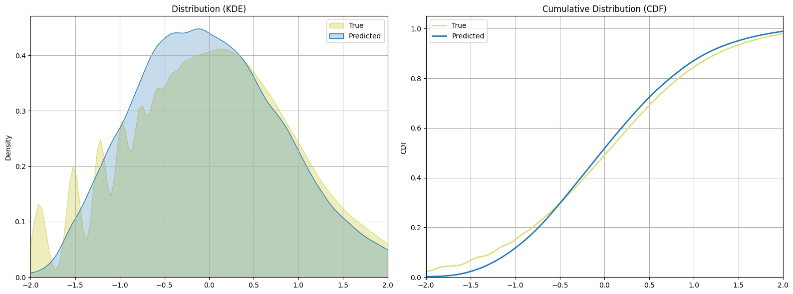
    


The plot compares the distributions of true and predicted taxi trip durations using a Neural Network (NN) model. The KDE and CDF plots shows that the neural network model provides a good fit to the taxi trip duration data, with predicted values closely matching the true values. While there are some minor discrepancies in the tails of the distribution, the overall alignment suggests that the model is effective at capturing the underlying patterns in the data.

# Simple Bayesian Neural Network

To incorporate uncertainty information, we will use Bayesian Neural Networks (BNNs). BNNs provide not only point estimates but also a measure of uncertainty, which allows for more informed decision-making. Because fitting a BNN using Keras is challenging, the idea is to create the model from scratch using TensorFlow and Keras API. We first began by creating a dense variational layer that receives the number of neurons and the activation function, similar to a standard layer in TensorFlow.

To illustrate the feedforward step in a Bayesian Neural Network (BNN), consider a BNN with two layers, where  $\mathbf{x}$  is a vector consisting of  $m$  neurons in the input layer, and  $\mathbf{y}$  is a vector consisting of  $n$   neurons in the output layer:

<center>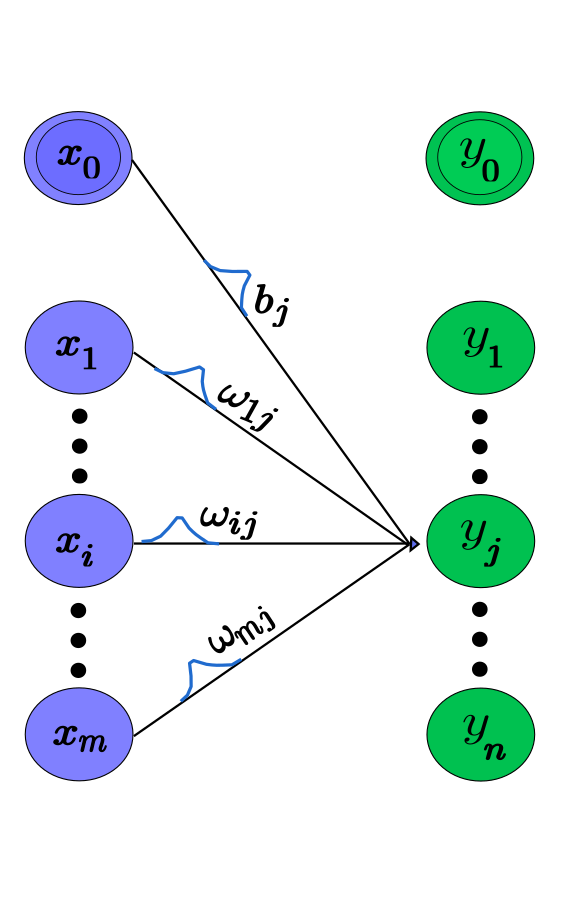</center>

For a BNN, weights and biases are not just fixed values. Instead, each weight and bias is associated with a mean and a variance, which are parameters of the normal distribution from which they are sampled at each forward step. This introduces variability in the weights and biases, allowing BNNs to inherently model uncertainty. A standard approach is the reparametrization trick to sample the weight and bias values from their respective independent normal distributions and to guarantee differentiability during the backpropagation step. To further understand, consider the weights and biases between the input and hidden layers:

$$w_{ij} = \mu_{ij} + \sigma_{ij} \cdot \epsilon_{ij} $$
$$b_{j} = \mu_{j} + \sigma_{j} \cdot \epsilon_{j} $$


To initialize the learnable variables $\mu_{ij}$ and $\sigma_{ij}$ for the distribution of the weights and biases, we can sample random values from a truncated normal distribution, represented as $\mathcal{T}\left(0, \sqrt{\frac{2}{n+m}}\right)$. This is done within the `xavier` method of the class. This particular distribution ensures that the initialized weights and biases aren't too distant from the mean, as extreme values might negatively affect the learning process. The matrix representation for the mean and variance of weights and biases are:

$$ 
{\mu}_w =
\left( \begin{array}{cccc}
\mu_{11} & \cdots & \mu_{1n}\\
\vdots & \ddots & \vdots\\
\mu_{m1} & \cdots &\mu_{mn}
\end{array} \right)~~~~
{\Sigma}_w =
\left( \begin{array}{cccc}
\sigma_{11} & \cdots & \sigma_{1n}\\
\vdots & \ddots & \vdots\\
\sigma_{m1} & \cdots &\sigma_{mn}
\end{array} \right).
$$

and

$$ 
{\mu}_b =
\left( \begin{array}{c}
\mu_{1} \\
\vdots \\
\mu_{n}
\end{array} \right)~~~~
{\Sigma}_b =
\left( \begin{array}{c}
\sigma_{1}\\
\vdots\\
\sigma_{n}
\end{array} \right).
$$

Here, each $w_{ij}$ connects the $i$-th neuron in the input layer to the $j$-th neuron in the next layer, sampled from a normal distribution $\mathcal{N}(\mu_{ij}, \sigma_{ij})$, where $\mu_{ij}$ and $\sigma_{ij}$ are learnable parameters for the mean and standard deviation, and $\epsilon_{ij}$ is the perturbation sampled from a normal distribution $\mathcal{N}(0, 1)$. The same idea applies to the bias term $b_{j}$. In matrix notation, for all connections of the weights and biases between the two layers, we have:

$$\mathbf{W} = \mu_w + \Sigma_w \odot \epsilon_w $$
$$\mathbf{b} = \mu_b + \Sigma_b \odot \epsilon_b $$

where

$$
\mathbf{W} =
\left( \begin{array}{cccc}
w_{11} & \cdots & w_{1n}\\
\vdots & \ddots & \vdots\\
w_{m1} & \cdots &w_{mn}
\end{array} \right),~~~~
\mathbf{b} =
\left( \begin{array}{c}
b_{1}\\
\vdots\\
b_{n}
\end{array} \right)
$$

So to sample the matrix $\mathbf{W}$ for the weights of a layer, we calculate the posterior normal distribution $p(\mathbf{w}| \mathbf{x}) \sim \mathcal{N}(\mu_{w}, \Sigma_{w})$ given the input data $\mathbf{x}$.


However, there is a computational problem with this approach: the reparameterization trick can use the same noise $\epsilon_{ij}$ for the entire batch. This means that for a given batch, all the weight samples share the same noise term, which introduces correlation across different samples within the batch. This correlation leads to noisy gradient estimates because each gradient update is influenced by the same noise terms.

To address this issue, we need a way to decorrelate these samples to ensure that the noise affecting the weights and biases is different for each forward step within the batch. The [Flipout method](https://arxiv.org/abs/1803.04386) can be used for this purpose. Flipout introduces additional perturbations with random sign matrices (matrices with $\pm 1$ entries), which effectively decorrelates the samples across different forward passes within a batch.

The Flipout method uses clever perturbations to implicitly sample from the weight and bias distributions without using the same perturbation for each batch. This is achieved by creating perturbations in the input batch matrix $\mathbf{x_i}$ from the previous layer and also by multiplying the noise $\epsilon$ by random sign matrices. This ensures that the perturbations are different for each batch, reducing the correlation introduced by using the same distribution to sample the noise $\epsilon$ across the entire batch.

Flipout use a base perturbation  $\epsilon$   shared by all examples in the batch and multiplies it by a different sign matrix for each example:

$$\epsilon_i = \epsilon \odot (\mathbf{r}_i \mathbf{s}_i^T) $$

where  $\mathbf{r}_i$   and  $\mathbf{s}_i$   are random vectors whose entries are sampled uniformly from  $\pm 1$  .

Considering the previous illustration of a BNN with two layers, the feedforward step for the  $i$-th batch  $\mathbf{x_i}$   would have the following structure without Flipout:

$$
\left\{ \begin{array}{ll} 
\mathbf{\textrm{net}} = \mathbf{x_i} \cdot \mathbf{W} \\
\mathbf{y_i} = f \left(\mathbf{\textrm{net}}\right)
\end{array}\right.
$$

where  $f(.)$   is the activation function. For simplicity, we will only focus on the weight term. To sample  $\mathbf{W}$   by using the Flipout method, we would have:

$$\mathbf{W} = \mu_{w} + \Sigma_{w} \odot \epsilon_i $$

The formulation is similar to the reparameterization trick to sample the weights, with the difference being the perturbation term. Substituting in the  $\textrm{net}$   equation:

$$
\begin{align*}
\mathbf{\textrm{net}} &= \mathbf{x_i}(\mu + (\Sigma_{w} \odot \epsilon) \odot (\mathbf{r}_i \mathbf{s}_i^T))\\
&= \mathbf{x_i}\mu + (\Sigma_{w} \odot \epsilon) \odot \left((\mathbf{x_i}\odot \mathbf{s}_i^T) \odot \mathbf{r}_i)\right) 
\end{align*}
$$

This results in the following equation for a batch in the BNN using Flipout:

$$\mathbf{y_i} = f(\mathbf{x_i}\mu + (\Sigma_{w} \odot \epsilon) \odot \left((\mathbf{x_i}\odot \mathbf{s}_i^T) \odot \mathbf{r}_i)\right) $$


This Flipout method is calculated in our `call` method for the class DenseFlipout.


For the losses computed in each layer, within the method `layer_losses`, we will use the Kullback-Leibler (KL) Divergence (Relative Entropy). The KL divergence is a measure that quantifies the difference or "distance" between two probability distributions. Given two probability distributions for the weights, the posterior distribution $p(\mathbf{W}| \mathbf{x}) \sim \mathcal{N}(\mu_{w}, \Sigma_{w})$ and the prior distribution $q(\mathbf{W}) \sim \mathcal{N}(0, 1)$, the KL divergence can be defined using the following equation:


$$D_{KL}(q||p) = \int q(\mathbf{W})\log{\bigg(\frac{q(\mathbf{W})}{p(\mathbf{W}| \mathbf{x})}\bigg)} dW$$

The KL divergence can be interpreted as the expected logarithmic difference between the two probability distributions, with the expectation taken over the values of $\mathbf{W}$ according to the posterior distribution $p(\mathbf{W}| \mathbf{x})$. In essence, the KL divergence quantifies the amount of information lost when we approximate the posterior distribution $p(\mathbf{W}| \mathbf{x})$ using the prior distribution $q(\mathbf{W})$.

$$D_{KL}(p||q) =\mathbb{E}\bigg[\log{\bigg(\frac{q(\mathbf{W})}{p(\mathbf{W}| \mathbf{x})}\bigg)}\bigg] $$

By encouraging the posterior distribution to remain close to the prior (standard normal), we are effectively regularizing the network. This regularization helps to prevent overfitting by penalizing weights that deviate too far from zero, thereby favoring simpler models that generalize better. The goal is to update this prior belief to a posterior distribution after observing the data $\mathbf{x}$. The KL divergence term in the loss function ensures that the learned weights do not stray too far from our prior belief unless supported by the data.


```python
class DenseFlipout(Layer):
    def __init__(self, units, activation=None, name = 'DenseVariational'):
        
        """
        Initializes the custom variational dense layer with flipout.

        Args:
            units (int): The number of neurons in the dense layer.
            activation (str or callable, optional): The activation function to use on the layer's output. 
                Defaults to None, which means no activation is applied.
            name (str): The name of the layer.
        """
              
        super(DenseFlipout, self).__init__(name = name)

        self.units = units
        self.activation = tf.keras.activations.get(activation)

    def xavier(self, shape):

        """
        Performs Xavier initialization for the layer's weights and biases.

        Args:
            shape (tuple): The shape of the tensor to initialize.

        Returns:
            tf.Tensor: A tensor with the specified shape initialized using the Xavier initialization method.
        """
        xavier_dist = tf.random.truncated_normal(shape=shape, mean=0.0, stddev=np.sqrt(2.0 / sum(shape)))

        return xavier_dist

    def build(self, input_shape):

        """
        Builds the variational dense layer by initializing weights and biases with their respective means and standard deviations.

        Args:
            input_shape (tuple): The shape of the input to the layer, used to determine the weight shapes.
        """
        self.d_in = input_shape[-1]
        # Initializing mean and standard deviation for weights and biases to represent their posterior distributions.
        self.w_loc = tf.Variable(self.xavier((self.d_in, self.units)), name='w_loc')
        self.w_std = tf.Variable(self.xavier((self.d_in, self.units)) - 6.0, name='w_std')
        self.b_loc = tf.Variable(self.xavier((1, self.units)), name='b_loc')
        self.b_std = tf.Variable(self.xavier((1, self.units)) - 6.0, name='b_std')

    def call(self, x, training = True):

        """
        Performs the forward pass through the layer, either stochastically if in training mode, or deterministically.

        Args:
            x (tf.Tensor): Input tensor to the layer.
            training (bool): Boolean flag indicating whether the layer is in training mode.

        Returns:
            tf.Tensor: Output tensor after applying the variational dense layer.
        """

        if training: # Stochastic forward pass (sampling process)
            
            # random sign matrix (+-1 entries) perturbation
            s = tfp.random.rademacher(tf.shape(x)) # Sign matrix for input perturbation
            r = tfp.random.rademacher([tf.shape(x)[0], self.units])  # Sign matrix for output perturbation
            
            # For Weights
            # Softplus to ensure std is positive
            w_std_positive = tf.nn.softplus(self.w_std)
            w_noise = tf.random.normal(shape = [self.d_in, self.units])
            w_flipout_noise = r*tf.matmul(x*s , w_std_positive*w_noise)
            w_sample = tf.matmul(x, self.w_loc) + w_flipout_noise
            
            # For Bias
            # Softplus to ensure std is positive
            r = tfp.random.rademacher([tf.shape(x)[0], self.units])
            b_std_positive = tf.nn.softplus(self.b_std)
            b_noise = tf.random.normal(shape = [self.units])
            b_flipout_noise = r*b_std_positive*b_noise
            b_sample = self.b_loc + b_flipout_noise
            
            
            output = w_sample + b_sample

        else: # Deterministic forward pass
            output =  x @ self.w_loc + self.b_loc
        
        if self.activation is not None:
            output = self.activation(output)
            
        return output

    @property
    def layer_losses(self):

        """
        Computes the regularization loss for this layer, quantified as the Kullback-Leibler (KL) divergence 
        between the approximate posterior and the prior distributions of the layer's weights and biases. 
        This loss term encourages the weights to remain close to the prior, preventing overfitting and 
        ensuring that the learned representations are robust.

        Returns:
            tf.Tensor: The computed regularization loss for this layer, as a scalar tensor.
        """

        # Prior distribution 
        prior = tfd.Normal(loc=0, scale=1)

        # Posterior distributions
        # Softplus to ensure std is positive
        weight_posterior = tfd.Normal(loc=self.w_loc, scale=tf.nn.softplus(self.w_std))
        bias_posterior = tfd.Normal(loc=self.b_loc, scale=tf.nn.softplus(self.b_std))

        # Kullback-Leibler divergence between posterior and prior distributions
        kl_w = tf.reduce_sum(tfd.kl_divergence(weight_posterior, prior))
        kl_b = tf.reduce_sum(tfd.kl_divergence(bias_posterior, prior))

        return kl_w + kl_b
```

After defining a single Bayesian neural network layer, we can create another class that represents a Bayesian Neural Network (BNN) with multiple layers. This class will aggregate all the layers in the network and account for the KL divergence of each layer. The network_losses property ensures that the total KL divergence is computed by summing the contributions from all layers, which is essential for optimizing the Evidence Lower Bound (ELBO) during training.


```python
class BNN(Model):
    def __init__(self,
                 layer_units: list = [5, 5],
                 output_unit: int = 1,
                 activation_func: str = 'relu',
                 output_activation: str = None, 
                 name = "BayesianNN"):
        """
        Initializes a Bayesian Neural Network with variational dense layers.

        Args:
            layer_units (list): A list of integers representing the number of units in each hidden layer.
            output_unit (int): The number of units in the output layer.
            activation_func (str): The activation function to use for all hidden layers.
            kl_weight (float): The weight factor for the Kullback-Leibler divergence term in the loss function.
            name (str): The name of the model.
        """
        

        super(BNN, self).__init__(name=name)

        self.layer_units = layer_units
        self.output_unit = output_unit
        self.activation_func = activation_func

        self.layer_list = []
        for i in range(len(layer_units)):
            self.layer_list += [ DenseFlipout( units=layer_units[i],
                                               activation=activation_func,
                                               name='DenseVariational_{}'.format(i)
                                               )]
            
        self.layer_list += [ DenseFlipout(  units = self.output_unit,
                                            activation = output_activation,
                                            name = 'OutputLayer'
                                            )]
    
    def call(self, x):
        """
        Executes a forward pass through the network.

        Args:
            x (Tensor): The input tensor.

        Returns:
            Tensor: The output of the network after passing through all the layers.
        """
        for layer in self.layer_list:
            x = layer(x)
        return x
    
    @property
    def network_losses(self):
        """
        Aggregates the KL divergence losses from all layers into a single loss term.

        Returns:
            Tensor: The sum of the KL divergence losses from all layers.
        """
        # Summing up the KL divergence losses from all variational layers
        return tf.reduce_sum([layer.layer_losses for layer in self.layer_list]) 
```

Now we can construct our regression model using the BNN with multiple layers. For this part, we desire to construct the BNN with the following structure, as illustrated below:

<center>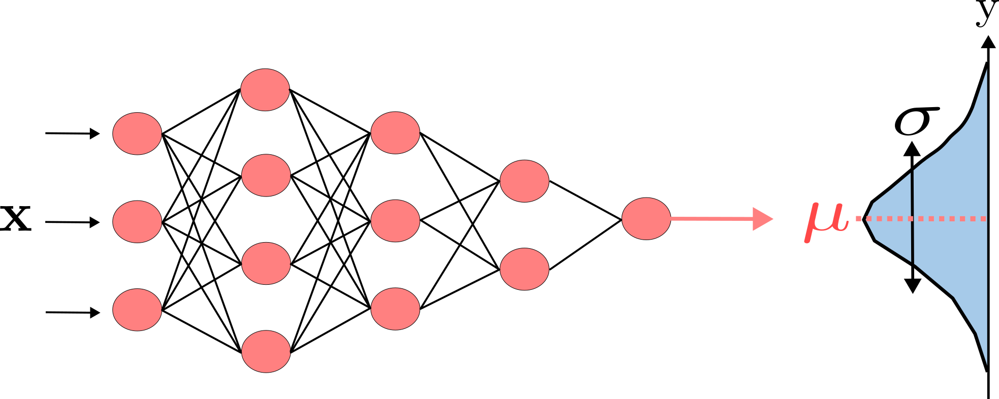</center>

This model gives us predictions of the mean $\mu$ and the standard deviation $\sigma$ based on the input data $\mathbf{x}$. The mean prediction comes from the network by learning the weight parameters sampled from the posterior normal distribution $\mathcal{N}(\mu_{w}, \Sigma_{w})$ defined in the `DenseFlipout` layer, where $\mu_{w}$ and $\Sigma_{w}$ are matrices of the learnable parameters for the mean and standard deviation of this posterior distribution. On the other hand, the predicted standard deviation $\sigma$ is modeled using the inverse square root of a gamma distribution $\Gamma(\alpha, \beta)$ with learnable parameters $\alpha$ for the shape and $\beta$ for the rate. During the training process, the model updates these parameters based on the data, resulting in a posterior distribution that best represents the uncertainty in the standard deviation, similar to what we have for the mean.

In this part of the model, the KL divergence is calculated for the prior and posterior gamma distributions and summed with the KL divergence of the normal distribution that comes from the layers, resulting in a total KL divergence for the whole network. This total KL divergence is used to calculate and take the gradient of the Evidence Lower Bound (ELBO) term inside the `_train_evaluate` method.

The ELBO term comes from the KL divergence itself, by making some mathematical manipulations on the equation of the KL divergence:

$$D_{KL}(q||p) = \int q(\mathbf{W})\log{\bigg(\frac{q(\mathbf{W})}{p(\mathbf{W}| \mathbf{x})}\bigg)} dW.$$

This manipulation decomposes this equation into two terms: the ELBO and the log likelihood of the distribution of the input data $\mathbf{x}$.

$$D_{KL}(q||p) = -\mathbb{E}_{\mathbf{W} \sim q}\bigg[\log{\frac{p(\mathbf{x}|\mathbf{W})p(\mathbf{W})}{q(\mathbf{W})}}\bigg] + \log{p(\mathbf{x})}$$


The expectation term is the Evidence Lower Bound (ELBO):

$$\text{ELBO}(q(\mathbf{W})) = \mathbb{E}_{\mathbf{W} \sim q}\bigg[\log{\frac{p(\mathbf{D}|\mathbf{W})p(\mathbf{W})}{q(\mathbf{W})}}\bigg]$$

The log likelihood term, $\log{p(\mathbf{x})}$, is a constant that depends only on the input data $\mathbf{x}$.

Since the KL divergence must be non-negative, $D_{KL}(q||p) \geq 0$, as it measures the information loss between the true posterior distribution $p(\mathbf{W}| \mathbf{x})$ and the variational distribution $q(\mathbf{W})$, we have the following inequality:


$$-\text{ELBO}(q(\mathbf{W})) + \log{p(\mathbf{x})}\geq 0$$

This inequality clearly indicates that the ELBO serves as a lower bound to the log marginal likelihood, $\log{p(\mathbf{x})}$, hence the name Evidence Lower Bound. Maximizing the ELBO is equivalent to minimizing the KL divergence between the variational distribution $q(\mathbf{W})$ and the posterior distribution $p(\mathbf{W}|\mathbf{x})$. By minimizing the information loss represented by the KL divergence, we are effectively approximating the true posterior with the variational distribution.

For the code below, the ELBO will be the sum of all KL divergences divided by the total size of the input data minus the reduced sum of the log likelihood, where the goal is to minimize the negative ELBO (equivalent to maximizing the ELBO)


```python
class BNNRegressor(Model):   
    
    def __init__(self, layers, total_samples, name = None):
        super(BNNRegressor, self).__init__(name = name)

        # Trackers for training metrics
        self.train_elbo_tracker = Mean(name='train_elbo')
        self.train_mae_tracker = MeanAbsoluteError(name='train_mae')

        # Trackers for validation metrics
        self.val_elbo_tracker = Mean(name='val_elbo')
        self.val_mae_tracker = MeanAbsoluteError(name='val_mae')

        # Variational distribution for observed data
        self.loc_net = BNN(layer_units = layers,
                           activation_func = 'relu')
        
        # trainable variables for the standard distribution 
        self.std_alpha = tf.Variable([10.0], name='std_alpha')
        self.std_beta = tf.Variable([10.0], name='std_beta')
        
        self.total_samples = total_samples

    def call(self, x, training = True):

        # Predict mean
        loc_preds = self.loc_net(x, training = training)
        
        # Predict std deviation using Gamma
        std_gamma = tfp.distributions.Gamma(self.std_alpha, self.std_beta)
        
        inverse_sqrt_transform = lambda x: tf.sqrt(tf.math.reciprocal(x))
        N = tf.shape(x)[0]
        if training:
            # transforms the precision sampled from the gamma distribution to standard deviation.
            std_preds = inverse_sqrt_transform(std_gamma.sample([N], name='gamma_sample'))
        else:
            std_preds = tf.ones([N, 1])*inverse_sqrt_transform(std_gamma.mean(name='gamma_sample'))

        return tf.concat([loc_preds, std_preds], 1)
    
    def train_step(self, data):
        x, y = data
        elbo_loss, preds = self._train_evaluate(x, y)
        y_loc_pred = preds[:, 0]

        self.train_mae_tracker.update_state(y, y_loc_pred)
        self.train_elbo_tracker.update_state(elbo_loss) 

        dict_losses = { "train_mae": self.train_mae_tracker.result(), 
                        "train_elbo":self.train_elbo_tracker.result()}
        return dict_losses

    @tf.function
    def _train_evaluate(self, x,  y):
        with tf.GradientTape() as tape:
            log_likelihoods, preds  = self.log_likelihood(x, y)
            elbo_loss = self.total_kl_loss/self.total_samples  - tf.reduce_mean(log_likelihoods)

        grads = tape.gradient(elbo_loss, self.trainable_weights)  
        if self.optimizer != None:
            self.optimizer.apply_gradients(zip(grads, self.trainable_weights))       

        return elbo_loss, preds
    
    def test_step(self, data):
        x, y = data
        elbo_loss, preds = self._test_evaluate(x, y)
        y_loc_pred = preds[:, 0]
        
        self.val_mae_tracker.update_state(y, y_loc_pred)
        self.val_elbo_tracker.update_state(elbo_loss) 

        dict_losses = { "mae": self.val_mae_tracker.result(), 
                        "elbo":self.val_elbo_tracker.result()}
        return dict_losses
    
    @tf.function
    def _test_evaluate(self, x, y):
        log_likelihoods, preds = self.log_likelihood(x, y, training=False)
        elbo_loss = self.total_kl_loss / self.total_samples - tf.reduce_mean(log_likelihoods)
        return elbo_loss, preds   

    def log_likelihood(self, x, y, training = True):
        
        preds = self.call(x, training = training)
        
        # Ensure consistent dtypes
        loc = tf.cast(preds[:, 0], dtype=tf.float32)
        std = tf.cast(preds[:, 1], dtype=tf.float32)
        y = tf.cast(y[:, 0], dtype=tf.float32)
        
        log_likelihood = tfd.Normal(loc, std).log_prob(y)
        return  log_likelihood, preds
    
    @tf.function
    def sample(self, x):
        preds = self.call(x)
        loc = tf.cast(preds[:, 0], dtype=tf.float32)
        std = tf.cast(preds[:, 1], dtype=tf.float32)
        return tfp.distributions.Normal(loc, std).sample()
    
    def samples(self, x, n_sample = 1):
        N = x.shape[0]
        samples = np.zeros((N, n_sample))
        for i in range(n_sample):
            samples[:,i] = self.sample(x)
        return samples
    
    @property
    def total_kl_loss(self):
        # KL loss from the mean based on data
        loc_kl_loss = self.loc_net.network_losses

        # KL loss from the standard deviation based on data
        prior  = tfp.distributions.Gamma(10.0, 10.0)  #prior is fixed 
        posterior = tfp.distributions.Gamma(self.std_alpha, self.std_beta)
        std_kl_loss = tfp.distributions.kl_divergence(posterior, prior)

        return loc_kl_loss + std_kl_loss
```


```python
bnn_regressor = BNNRegressor([1024, 512, 128, 64, 32], total_samples= X_train.shape[0])
bnn_regressor.compile(optimizer = tf.keras.optimizers.Adam(learning_rate=1e-4))
bnn_history = bnn_regressor.fit(X_train, Y_train[:, None], batch_size=1024, epochs=150, validation_data=(X_val, Y_val[:, None]), verbose=1)

# Save Model
bnn_regressor.predict(X_test)
current_directory = os.getcwd()
save_dir = os.path.expanduser( current_directory + '/models/bnn_regressor')
bnn_regressor.save(save_dir)

```

    Epoch 1/150
    382/382 [==============================] - 39s 96ms/step - train_mae: 0.5887 - train_elbo: 9.8080 - val_mae: 0.4213 - val_elbo: 9.6058
    Epoch 2/150
    382/382 [==============================] - 36s 95ms/step - train_mae: 0.4066 - train_elbo: 9.5929 - val_mae: 0.3969 - val_elbo: 9.5314
    Epoch 3/150
    382/382 [==============================] - 37s 96ms/step - train_mae: 0.3951 - train_elbo: 9.5266 - val_mae: 0.3918 - val_elbo: 9.4699
    Epoch 4/150
    382/382 [==============================] - 37s 96ms/step - train_mae: 0.3899 - train_elbo: 9.4644 - val_mae: 0.3859 - val_elbo: 9.4081
    Epoch 5/150
    382/382 [==============================] - 37s 97ms/step - train_mae: 0.3870 - train_elbo: 9.4040 - val_mae: 0.3895 - val_elbo: 9.3504
    Epoch 6/150
    382/382 [==============================] - 37s 96ms/step - train_mae: 0.3843 - train_elbo: 9.3441 - val_mae: 0.3824 - val_elbo: 9.2885
    Epoch 7/150
    382/382 [==============================] - 37s 96ms/step - train_mae: 0.3823 - train_elbo: 9.2837 - val_mae: 0.3807 - val_elbo: 9.2289
    Epoch 8/150
    382/382 [==============================] - 36s 96ms/step - train_mae: 0.3811 - train_elbo: 9.2245 - val_mae: 0.3813 - val_elbo: 9.1709
    Epoch 9/150
    382/382 [==============================] - 37s 96ms/step - train_mae: 0.3799 - train_elbo: 9.1658 - val_mae: 0.3809 - val_elbo: 9.1121
    Epoch 10/150
    382/382 [==============================] - 37s 97ms/step - train_mae: 0.3790 - train_elbo: 9.1068 - val_mae: 0.3759 - val_elbo: 9.0517
    Epoch 11/150
    382/382 [==============================] - 37s 97ms/step - train_mae: 0.3784 - train_elbo: 9.0478 - val_mae: 0.3777 - val_elbo: 8.9946
    Epoch 12/150
    382/382 [==============================] - 37s 96ms/step - train_mae: 0.3774 - train_elbo: 8.9892 - val_mae: 0.3763 - val_elbo: 8.9357
    Epoch 13/150
    382/382 [==============================] - 36s 94ms/step - train_mae: 0.3762 - train_elbo: 8.9302 - val_mae: 0.3761 - val_elbo: 8.8775
    Epoch 14/150
    382/382 [==============================] - 36s 95ms/step - train_mae: 0.3761 - train_elbo: 8.8725 - val_mae: 0.3760 - val_elbo: 8.8197
    Epoch 15/150
    382/382 [==============================] - 36s 95ms/step - train_mae: 0.3756 - train_elbo: 8.8138 - val_mae: 0.3802 - val_elbo: 8.7639
    Epoch 16/150
    382/382 [==============================] - 36s 95ms/step - train_mae: 0.3751 - train_elbo: 8.7559 - val_mae: 0.3741 - val_elbo: 8.7028
    Epoch 17/150
    382/382 [==============================] - 36s 96ms/step - train_mae: 0.3744 - train_elbo: 8.6981 - val_mae: 0.3769 - val_elbo: 8.6468
    Epoch 18/150
    382/382 [==============================] - 36s 96ms/step - train_mae: 0.3744 - train_elbo: 8.6404 - val_mae: 0.3753 - val_elbo: 8.5890
    Epoch 19/150
    382/382 [==============================] - 37s 96ms/step - train_mae: 0.3739 - train_elbo: 8.5828 - val_mae: 0.3724 - val_elbo: 8.5300
    Epoch 20/150
    382/382 [==============================] - 37s 96ms/step - train_mae: 0.3736 - train_elbo: 8.5257 - val_mae: 0.3746 - val_elbo: 8.4741
    Epoch 21/150
    382/382 [==============================] - 37s 96ms/step - train_mae: 0.3731 - train_elbo: 8.4680 - val_mae: 0.3726 - val_elbo: 8.4161
    Epoch 22/150
    382/382 [==============================] - 37s 97ms/step - train_mae: 0.3727 - train_elbo: 8.4108 - val_mae: 0.3714 - val_elbo: 8.3598
    Epoch 23/150
    382/382 [==============================] - 37s 96ms/step - train_mae: 0.3727 - train_elbo: 8.3546 - val_mae: 0.3709 - val_elbo: 8.3018
    Epoch 24/150
    382/382 [==============================] - 36s 95ms/step - train_mae: 0.3724 - train_elbo: 8.2971 - val_mae: 0.3718 - val_elbo: 8.2457
    Epoch 25/150
    382/382 [==============================] - 36s 95ms/step - train_mae: 0.3724 - train_elbo: 8.2409 - val_mae: 0.3716 - val_elbo: 8.1894
    Epoch 26/150
    382/382 [==============================] - 37s 96ms/step - train_mae: 0.3721 - train_elbo: 8.1841 - val_mae: 0.3702 - val_elbo: 8.1328
    Epoch 27/150
    382/382 [==============================] - 37s 96ms/step - train_mae: 0.3716 - train_elbo: 8.1280 - val_mae: 0.3734 - val_elbo: 8.0783
    Epoch 28/150
    382/382 [==============================] - 37s 96ms/step - train_mae: 0.3714 - train_elbo: 8.0717 - val_mae: 0.3743 - val_elbo: 8.0230
    Epoch 29/150
    382/382 [==============================] - 37s 96ms/step - train_mae: 0.3717 - train_elbo: 8.0162 - val_mae: 0.3707 - val_elbo: 7.9652
    Epoch 30/150
    382/382 [==============================] - 37s 96ms/step - train_mae: 0.3713 - train_elbo: 7.9603 - val_mae: 0.3692 - val_elbo: 7.9092
    Epoch 31/150
    382/382 [==============================] - 36s 96ms/step - train_mae: 0.3711 - train_elbo: 7.9043 - val_mae: 0.3694 - val_elbo: 7.8544
    Epoch 32/150
    382/382 [==============================] - 37s 96ms/step - train_mae: 0.3710 - train_elbo: 7.8498 - val_mae: 0.3693 - val_elbo: 7.7989
    Epoch 33/150
    382/382 [==============================] - 37s 96ms/step - train_mae: 0.3709 - train_elbo: 7.7947 - val_mae: 0.3700 - val_elbo: 7.7445
    Epoch 34/150
    382/382 [==============================] - 37s 97ms/step - train_mae: 0.3706 - train_elbo: 7.7392 - val_mae: 0.3700 - val_elbo: 7.6896
    Epoch 35/150
    382/382 [==============================] - 37s 96ms/step - train_mae: 0.3708 - train_elbo: 7.6845 - val_mae: 0.3741 - val_elbo: 7.6378
    Epoch 36/150
    382/382 [==============================] - 36s 95ms/step - train_mae: 0.3703 - train_elbo: 7.6302 - val_mae: 0.3714 - val_elbo: 7.5818
    Epoch 37/150
    382/382 [==============================] - 37s 96ms/step - train_mae: 0.3707 - train_elbo: 7.5762 - val_mae: 0.3686 - val_elbo: 7.5259
    Epoch 38/150
    382/382 [==============================] - 37s 96ms/step - train_mae: 0.3702 - train_elbo: 7.5210 - val_mae: 0.3686 - val_elbo: 7.4721
    Epoch 39/150
    382/382 [==============================] - 37s 96ms/step - train_mae: 0.3705 - train_elbo: 7.4678 - val_mae: 0.3693 - val_elbo: 7.4195
    Epoch 40/150
    382/382 [==============================] - 36s 95ms/step - train_mae: 0.3703 - train_elbo: 7.4141 - val_mae: 0.3686 - val_elbo: 7.3651
    Epoch 41/150
    382/382 [==============================] - 37s 96ms/step - train_mae: 0.3704 - train_elbo: 7.3605 - val_mae: 0.3688 - val_elbo: 7.3122
    Epoch 42/150
    382/382 [==============================] - 36s 96ms/step - train_mae: 0.3699 - train_elbo: 7.3071 - val_mae: 0.3690 - val_elbo: 7.2589
    Epoch 43/150
    382/382 [==============================] - 37s 96ms/step - train_mae: 0.3702 - train_elbo: 7.2545 - val_mae: 0.3680 - val_elbo: 7.2060
    Epoch 44/150
    382/382 [==============================] - 37s 96ms/step - train_mae: 0.3703 - train_elbo: 7.2013 - val_mae: 0.3679 - val_elbo: 7.1534
    Epoch 45/150
    382/382 [==============================] - 37s 97ms/step - train_mae: 0.3702 - train_elbo: 7.1491 - val_mae: 0.3678 - val_elbo: 7.1012
    Epoch 46/150
    382/382 [==============================] - 37s 96ms/step - train_mae: 0.3700 - train_elbo: 7.0969 - val_mae: 0.3680 - val_elbo: 7.0491
    Epoch 47/150
    382/382 [==============================] - 37s 96ms/step - train_mae: 0.3700 - train_elbo: 7.0452 - val_mae: 0.3704 - val_elbo: 6.9986
    Epoch 48/150
    382/382 [==============================] - 37s 96ms/step - train_mae: 0.3701 - train_elbo: 6.9931 - val_mae: 0.3686 - val_elbo: 6.9457
    Epoch 49/150
    382/382 [==============================] - 37s 96ms/step - train_mae: 0.3702 - train_elbo: 6.9418 - val_mae: 0.3675 - val_elbo: 6.8938
    Epoch 50/150
    382/382 [==============================] - 37s 96ms/step - train_mae: 0.3698 - train_elbo: 6.8897 - val_mae: 0.3696 - val_elbo: 6.8441
    Epoch 51/150
    382/382 [==============================] - 36s 95ms/step - train_mae: 0.3699 - train_elbo: 6.8394 - val_mae: 0.3678 - val_elbo: 6.7918
    Epoch 52/150
    382/382 [==============================] - 36s 95ms/step - train_mae: 0.3700 - train_elbo: 6.7880 - val_mae: 0.3672 - val_elbo: 6.7407
    Epoch 53/150
    382/382 [==============================] - 36s 96ms/step - train_mae: 0.3701 - train_elbo: 6.7380 - val_mae: 0.3677 - val_elbo: 6.6907
    Epoch 54/150
    382/382 [==============================] - 37s 96ms/step - train_mae: 0.3700 - train_elbo: 6.6873 - val_mae: 0.3674 - val_elbo: 6.6405
    Epoch 55/150
    382/382 [==============================] - 37s 96ms/step - train_mae: 0.3700 - train_elbo: 6.6377 - val_mae: 0.3684 - val_elbo: 6.5912
    Epoch 56/150
    382/382 [==============================] - 37s 97ms/step - train_mae: 0.3702 - train_elbo: 6.5881 - val_mae: 0.3675 - val_elbo: 6.5417
    Epoch 57/150
    382/382 [==============================] - 37s 96ms/step - train_mae: 0.3700 - train_elbo: 6.5388 - val_mae: 0.3671 - val_elbo: 6.4926
    Epoch 58/150
    382/382 [==============================] - 37s 96ms/step - train_mae: 0.3702 - train_elbo: 6.4895 - val_mae: 0.3666 - val_elbo: 6.4430
    Epoch 59/150
    382/382 [==============================] - 37s 96ms/step - train_mae: 0.3701 - train_elbo: 6.4405 - val_mae: 0.3683 - val_elbo: 6.3956
    Epoch 60/150
    382/382 [==============================] - 37s 96ms/step - train_mae: 0.3698 - train_elbo: 6.3923 - val_mae: 0.3672 - val_elbo: 6.3461
    Epoch 61/150
    382/382 [==============================] - 37s 96ms/step - train_mae: 0.3702 - train_elbo: 6.3438 - val_mae: 0.3668 - val_elbo: 6.2982
    Epoch 62/150
    382/382 [==============================] - 37s 96ms/step - train_mae: 0.3701 - train_elbo: 6.2955 - val_mae: 0.3673 - val_elbo: 6.2508
    Epoch 63/150
    382/382 [==============================] - 36s 95ms/step - train_mae: 0.3702 - train_elbo: 6.2484 - val_mae: 0.3669 - val_elbo: 6.2029
    Epoch 64/150
    382/382 [==============================] - 36s 95ms/step - train_mae: 0.3703 - train_elbo: 6.2011 - val_mae: 0.3686 - val_elbo: 6.1564
    Epoch 65/150
    382/382 [==============================] - 36s 95ms/step - train_mae: 0.3702 - train_elbo: 6.1532 - val_mae: 0.3669 - val_elbo: 6.1089
    Epoch 66/150
    382/382 [==============================] - 37s 96ms/step - train_mae: 0.3702 - train_elbo: 6.1072 - val_mae: 0.3669 - val_elbo: 6.0622
    Epoch 67/150
    382/382 [==============================] - 37s 97ms/step - train_mae: 0.3703 - train_elbo: 6.0611 - val_mae: 0.3665 - val_elbo: 6.0159
    Epoch 68/150
    382/382 [==============================] - 37s 97ms/step - train_mae: 0.3706 - train_elbo: 6.0153 - val_mae: 0.3681 - val_elbo: 5.9706
    Epoch 69/150
    382/382 [==============================] - 37s 96ms/step - train_mae: 0.3704 - train_elbo: 5.9690 - val_mae: 0.3664 - val_elbo: 5.9243
    Epoch 70/150
    382/382 [==============================] - 37s 96ms/step - train_mae: 0.3704 - train_elbo: 5.9235 - val_mae: 0.3663 - val_elbo: 5.8792
    Epoch 71/150
    382/382 [==============================] - 37s 96ms/step - train_mae: 0.3705 - train_elbo: 5.8780 - val_mae: 0.3676 - val_elbo: 5.8347
    Epoch 72/150
    382/382 [==============================] - 37s 97ms/step - train_mae: 0.3706 - train_elbo: 5.8333 - val_mae: 0.3668 - val_elbo: 5.7893
    Epoch 73/150
    382/382 [==============================] - 37s 97ms/step - train_mae: 0.3709 - train_elbo: 5.7890 - val_mae: 0.3683 - val_elbo: 5.7459
    Epoch 74/150
    382/382 [==============================] - 36s 96ms/step - train_mae: 0.3709 - train_elbo: 5.7444 - val_mae: 0.3670 - val_elbo: 5.7006
    Epoch 75/150
    382/382 [==============================] - 36s 95ms/step - train_mae: 0.3708 - train_elbo: 5.7002 - val_mae: 0.3665 - val_elbo: 5.6566
    Epoch 76/150
    382/382 [==============================] - 37s 96ms/step - train_mae: 0.3707 - train_elbo: 5.6565 - val_mae: 0.3666 - val_elbo: 5.6131
    Epoch 77/150
    382/382 [==============================] - 36s 95ms/step - train_mae: 0.3706 - train_elbo: 5.6124 - val_mae: 0.3676 - val_elbo: 5.5704
    Epoch 78/150
    382/382 [==============================] - 37s 96ms/step - train_mae: 0.3708 - train_elbo: 5.5702 - val_mae: 0.3673 - val_elbo: 5.5273
    Epoch 79/150
    382/382 [==============================] - 37s 97ms/step - train_mae: 0.3711 - train_elbo: 5.5272 - val_mae: 0.3668 - val_elbo: 5.4844
    Epoch 80/150
    382/382 [==============================] - 37s 96ms/step - train_mae: 0.3710 - train_elbo: 5.4853 - val_mae: 0.3675 - val_elbo: 5.4423
    Epoch 81/150
    382/382 [==============================] - 37s 96ms/step - train_mae: 0.3710 - train_elbo: 5.4430 - val_mae: 0.3674 - val_elbo: 5.4005
    Epoch 82/150
    382/382 [==============================] - 37s 96ms/step - train_mae: 0.3711 - train_elbo: 5.4017 - val_mae: 0.3664 - val_elbo: 5.3585
    Epoch 83/150
    382/382 [==============================] - 37s 97ms/step - train_mae: 0.3711 - train_elbo: 5.3601 - val_mae: 0.3673 - val_elbo: 5.3176
    Epoch 84/150
    382/382 [==============================] - 37s 97ms/step - train_mae: 0.3711 - train_elbo: 5.3189 - val_mae: 0.3675 - val_elbo: 5.2769
    Epoch 85/150
    382/382 [==============================] - 37s 96ms/step - train_mae: 0.3710 - train_elbo: 5.2773 - val_mae: 0.3666 - val_elbo: 5.2357
    Epoch 86/150
    382/382 [==============================] - 37s 96ms/step - train_mae: 0.3711 - train_elbo: 5.2371 - val_mae: 0.3666 - val_elbo: 5.1951
    Epoch 87/150
    382/382 [==============================] - 37s 96ms/step - train_mae: 0.3712 - train_elbo: 5.1975 - val_mae: 0.3674 - val_elbo: 5.1558
    Epoch 88/150
    382/382 [==============================] - 36s 95ms/step - train_mae: 0.3712 - train_elbo: 5.1574 - val_mae: 0.3666 - val_elbo: 5.1155
    Epoch 89/150
    382/382 [==============================] - 37s 96ms/step - train_mae: 0.3713 - train_elbo: 5.1174 - val_mae: 0.3662 - val_elbo: 5.0759
    Epoch 90/150
    382/382 [==============================] - 37s 96ms/step - train_mae: 0.3715 - train_elbo: 5.0786 - val_mae: 0.3662 - val_elbo: 5.0372
    Epoch 91/150
    382/382 [==============================] - 37s 96ms/step - train_mae: 0.3712 - train_elbo: 5.0391 - val_mae: 0.3660 - val_elbo: 4.9979
    Epoch 92/150
    382/382 [==============================] - 37s 96ms/step - train_mae: 0.3714 - train_elbo: 5.0007 - val_mae: 0.3665 - val_elbo: 4.9597
    Epoch 93/150
    382/382 [==============================] - 37s 96ms/step - train_mae: 0.3714 - train_elbo: 4.9621 - val_mae: 0.3674 - val_elbo: 4.9221
    Epoch 94/150
    382/382 [==============================] - 37s 97ms/step - train_mae: 0.3716 - train_elbo: 4.9242 - val_mae: 0.3672 - val_elbo: 4.8834
    Epoch 95/150
    382/382 [==============================] - 37s 97ms/step - train_mae: 0.3714 - train_elbo: 4.8864 - val_mae: 0.3666 - val_elbo: 4.8460
    Epoch 96/150
    382/382 [==============================] - 37s 96ms/step - train_mae: 0.3715 - train_elbo: 4.8483 - val_mae: 0.3667 - val_elbo: 4.8088
    Epoch 97/150
    382/382 [==============================] - 37s 96ms/step - train_mae: 0.3717 - train_elbo: 4.8124 - val_mae: 0.3666 - val_elbo: 4.7715
    Epoch 98/150
    382/382 [==============================] - 36s 96ms/step - train_mae: 0.3715 - train_elbo: 4.7741 - val_mae: 0.3679 - val_elbo: 4.7359
    Epoch 99/150
    382/382 [==============================] - 37s 96ms/step - train_mae: 0.3716 - train_elbo: 4.7382 - val_mae: 0.3665 - val_elbo: 4.6979
    Epoch 100/150
    382/382 [==============================] - 37s 96ms/step - train_mae: 0.3718 - train_elbo: 4.7022 - val_mae: 0.3671 - val_elbo: 4.6626
    Epoch 101/150
    382/382 [==============================] - 37s 96ms/step - train_mae: 0.3716 - train_elbo: 4.6660 - val_mae: 0.3667 - val_elbo: 4.6261
    Epoch 102/150
    382/382 [==============================] - 37s 96ms/step - train_mae: 0.3715 - train_elbo: 4.6301 - val_mae: 0.3665 - val_elbo: 4.5905
    Epoch 103/150
    382/382 [==============================] - 37s 96ms/step - train_mae: 0.3719 - train_elbo: 4.5948 - val_mae: 0.3669 - val_elbo: 4.5556
    Epoch 104/150
    382/382 [==============================] - 37s 96ms/step - train_mae: 0.3718 - train_elbo: 4.5599 - val_mae: 0.3671 - val_elbo: 4.5204
    Epoch 105/150
    382/382 [==============================] - 37s 96ms/step - train_mae: 0.3718 - train_elbo: 4.5251 - val_mae: 0.3683 - val_elbo: 4.4870
    Epoch 106/150
    382/382 [==============================] - 37s 97ms/step - train_mae: 0.3719 - train_elbo: 4.4912 - val_mae: 0.3668 - val_elbo: 4.4522
    Epoch 107/150
    382/382 [==============================] - 37s 97ms/step - train_mae: 0.3716 - train_elbo: 4.4561 - val_mae: 0.3663 - val_elbo: 4.4176
    Epoch 108/150
    382/382 [==============================] - 36s 95ms/step - train_mae: 0.3717 - train_elbo: 4.4225 - val_mae: 0.3672 - val_elbo: 4.3842
    Epoch 109/150
    382/382 [==============================] - 37s 96ms/step - train_mae: 0.3717 - train_elbo: 4.3892 - val_mae: 0.3676 - val_elbo: 4.3509
    Epoch 110/150
    382/382 [==============================] - 37s 96ms/step - train_mae: 0.3716 - train_elbo: 4.3562 - val_mae: 0.3674 - val_elbo: 4.3182
    Epoch 111/150
    382/382 [==============================] - 37s 96ms/step - train_mae: 0.3718 - train_elbo: 4.3227 - val_mae: 0.3666 - val_elbo: 4.2841
    Epoch 112/150
    382/382 [==============================] - 37s 96ms/step - train_mae: 0.3720 - train_elbo: 4.2902 - val_mae: 0.3667 - val_elbo: 4.2514
    Epoch 113/150
    382/382 [==============================] - 37s 96ms/step - train_mae: 0.3719 - train_elbo: 4.2578 - val_mae: 0.3667 - val_elbo: 4.2198
    Epoch 114/150
    382/382 [==============================] - 36s 95ms/step - train_mae: 0.3716 - train_elbo: 4.2256 - val_mae: 0.3666 - val_elbo: 4.1877
    Epoch 115/150
    382/382 [==============================] - 36s 95ms/step - train_mae: 0.3716 - train_elbo: 4.1937 - val_mae: 0.3660 - val_elbo: 4.1556
    Epoch 116/150
    382/382 [==============================] - 36s 95ms/step - train_mae: 0.3719 - train_elbo: 4.1625 - val_mae: 0.3678 - val_elbo: 4.1262
    Epoch 117/150
    382/382 [==============================] - 37s 96ms/step - train_mae: 0.3721 - train_elbo: 4.1321 - val_mae: 0.3670 - val_elbo: 4.0944
    Epoch 118/150
    382/382 [==============================] - 37s 97ms/step - train_mae: 0.3718 - train_elbo: 4.1014 - val_mae: 0.3671 - val_elbo: 4.0638
    Epoch 119/150
    382/382 [==============================] - 37s 96ms/step - train_mae: 0.3720 - train_elbo: 4.0716 - val_mae: 0.3673 - val_elbo: 4.0342
    Epoch 120/150
    382/382 [==============================] - 37s 96ms/step - train_mae: 0.3719 - train_elbo: 4.0407 - val_mae: 0.3671 - val_elbo: 4.0039
    Epoch 121/150
    382/382 [==============================] - 37s 96ms/step - train_mae: 0.3718 - train_elbo: 4.0117 - val_mae: 0.3673 - val_elbo: 3.9744
    Epoch 122/150
    382/382 [==============================] - 37s 96ms/step - train_mae: 0.3720 - train_elbo: 3.9813 - val_mae: 0.3669 - val_elbo: 3.9448
    Epoch 123/150
    382/382 [==============================] - 37s 96ms/step - train_mae: 0.3720 - train_elbo: 3.9530 - val_mae: 0.3664 - val_elbo: 3.9151
    Epoch 124/150
    382/382 [==============================] - 37s 97ms/step - train_mae: 0.3719 - train_elbo: 3.9236 - val_mae: 0.3668 - val_elbo: 3.8871
    Epoch 125/150
    382/382 [==============================] - 37s 96ms/step - train_mae: 0.3723 - train_elbo: 3.8952 - val_mae: 0.3667 - val_elbo: 3.8584
    Epoch 126/150
    382/382 [==============================] - 36s 95ms/step - train_mae: 0.3720 - train_elbo: 3.8665 - val_mae: 0.3665 - val_elbo: 3.8299
    Epoch 127/150
    382/382 [==============================] - 36s 95ms/step - train_mae: 0.3718 - train_elbo: 3.8386 - val_mae: 0.3665 - val_elbo: 3.8015
    Epoch 128/150
    382/382 [==============================] - 37s 96ms/step - train_mae: 0.3715 - train_elbo: 3.8098 - val_mae: 0.3662 - val_elbo: 3.7737
    Epoch 129/150
    382/382 [==============================] - 37s 97ms/step - train_mae: 0.3718 - train_elbo: 3.7829 - val_mae: 0.3675 - val_elbo: 3.7475
    Epoch 130/150
    382/382 [==============================] - 37s 97ms/step - train_mae: 0.3718 - train_elbo: 3.7558 - val_mae: 0.3667 - val_elbo: 3.7195
    Epoch 131/150
    382/382 [==============================] - 37s 96ms/step - train_mae: 0.3717 - train_elbo: 3.7279 - val_mae: 0.3664 - val_elbo: 3.6926
    Epoch 132/150
    382/382 [==============================] - 37s 96ms/step - train_mae: 0.3717 - train_elbo: 3.7016 - val_mae: 0.3665 - val_elbo: 3.6660
    Epoch 133/150
    382/382 [==============================] - 37s 96ms/step - train_mae: 0.3718 - train_elbo: 3.6756 - val_mae: 0.3661 - val_elbo: 3.6394
    Epoch 134/150
    382/382 [==============================] - 37s 96ms/step - train_mae: 0.3716 - train_elbo: 3.6491 - val_mae: 0.3669 - val_elbo: 3.6145
    Epoch 135/150
    382/382 [==============================] - 37s 97ms/step - train_mae: 0.3715 - train_elbo: 3.6228 - val_mae: 0.3667 - val_elbo: 3.5884
    Epoch 136/150
    382/382 [==============================] - 37s 97ms/step - train_mae: 0.3717 - train_elbo: 3.5986 - val_mae: 0.3662 - val_elbo: 3.5627
    Epoch 137/150
    382/382 [==============================] - 37s 96ms/step - train_mae: 0.3718 - train_elbo: 3.5728 - val_mae: 0.3661 - val_elbo: 3.5376
    Epoch 138/150
    382/382 [==============================] - 37s 96ms/step - train_mae: 0.3718 - train_elbo: 3.5474 - val_mae: 0.3669 - val_elbo: 3.5135
    Epoch 139/150
    382/382 [==============================] - 36s 96ms/step - train_mae: 0.3716 - train_elbo: 3.5234 - val_mae: 0.3665 - val_elbo: 3.4888
    Epoch 140/150
    382/382 [==============================] - 37s 96ms/step - train_mae: 0.3716 - train_elbo: 3.4984 - val_mae: 0.3663 - val_elbo: 3.4645
    Epoch 141/150
    382/382 [==============================] - 37s 96ms/step - train_mae: 0.3714 - train_elbo: 3.4750 - val_mae: 0.3658 - val_elbo: 3.4406
    Epoch 142/150
    382/382 [==============================] - 37s 96ms/step - train_mae: 0.3715 - train_elbo: 3.4506 - val_mae: 0.3668 - val_elbo: 3.4173
    Epoch 143/150
    382/382 [==============================] - 36s 96ms/step - train_mae: 0.3717 - train_elbo: 3.4279 - val_mae: 0.3670 - val_elbo: 3.3944
    Epoch 144/150
    382/382 [==============================] - 37s 96ms/step - train_mae: 0.3717 - train_elbo: 3.4047 - val_mae: 0.3662 - val_elbo: 3.3706
    Epoch 145/150
    382/382 [==============================] - 37s 96ms/step - train_mae: 0.3714 - train_elbo: 3.3822 - val_mae: 0.3659 - val_elbo: 3.3479
    Epoch 146/150
    382/382 [==============================] - 37s 97ms/step - train_mae: 0.3715 - train_elbo: 3.3592 - val_mae: 0.3657 - val_elbo: 3.3254
    Epoch 147/150
    382/382 [==============================] - 37s 97ms/step - train_mae: 0.3715 - train_elbo: 3.3375 - val_mae: 0.3668 - val_elbo: 3.3041
    Epoch 148/150
    382/382 [==============================] - 37s 97ms/step - train_mae: 0.3715 - train_elbo: 3.3160 - val_mae: 0.3668 - val_elbo: 3.2821
    Epoch 149/150
    382/382 [==============================] - 37s 96ms/step - train_mae: 0.3717 - train_elbo: 3.2951 - val_mae: 0.3661 - val_elbo: 3.2604
    Epoch 150/150
    382/382 [==============================] - 36s 95ms/step - train_mae: 0.3714 - train_elbo: 3.2719 - val_mae: 0.3659 - val_elbo: 3.2391
    12202/12202 [==============================] - 12s 956us/step
    INFO:tensorflow:Assets written to: /home/marcos/GitHub/bayesian-neural-network/02-regression/models/bnn_regressor/assets


    INFO:tensorflow:Assets written to: /home/marcos/GitHub/bayesian-neural-network/02-regression/models/bnn_regressor/assets


```python
fig, axs = plt.subplots(1, 2, figsize=(15, 6))

axs[0].plot(bnn_history.history['train_mae'], color='black', label='Train')
axs[0].plot(bnn_history.history['val_mae'], color='#d08f10ff', label='Validation')
axs[0].set_xlabel('Epoch')
axs[0].set_ylabel('Mean Absolute Error')
axs[0].set_title('MAE vs Epochs')
axs[0].legend()
axs[0].grid()

axs[1].plot(bnn_history.history['train_elbo'], color='black', label='Train')
axs[1].plot(bnn_history.history['val_elbo'], color='#d08f10ff', label='Validation')
axs[1].set_xlabel('Epoch')
axs[1].set_ylabel('ELBO')
axs[1].set_title('ELBO vs Epochs')
axs[1].legend()
axs[1].grid()


plt.show()
```


    
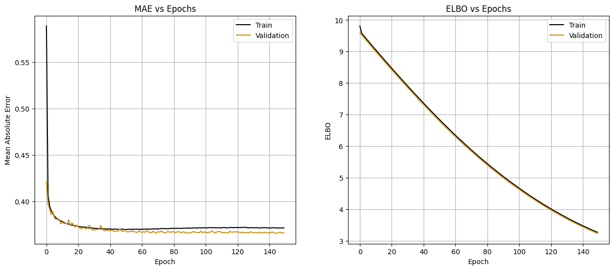
    


```python
bnn_preds = bnn_regressor.predict(X_test)

# distributions plot
plt.figure(figsize=(16, 6))

# KDE plot for residuals
plt.subplot(1, 2, 1)
sns.kdeplot(Y_test, fill=True, color="#dfdc7bff" , alpha=0.5, label='True')
sns.kdeplot(bnn_preds[:, 0], fill=True, color="#d08f10ff",  label='Predicted')
plt.legend()
plt.ylabel('Density')
plt.title('Distribution (KDE)')
plt.grid()
plt.xlim(-2, 2)

# CDF plot
plt.subplot(1, 2, 2)
sns.kdeplot(Y_test, cumulative=True, color="#dfdc7bff", linewidth=2, label='True')
sns.kdeplot(bnn_preds[:, 0], cumulative=True, color="#d08f10ff", linewidth=2,  label='Predicted')
plt.legend()
plt.ylabel('CDF')
plt.title('Cumulative Distribution (CDF)')
plt.grid()
plt.xlim(-2, 2)

plt.tight_layout()
plt.show()
```

    12202/12202 [==============================] - 15s 1ms/step


    
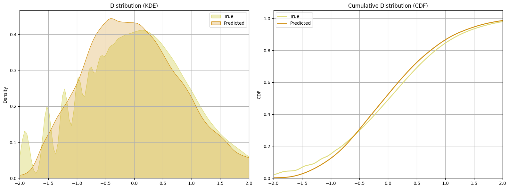
    


The BNN get a very good result similar to the simple neural network. However, there is a limitation with this approach: while the gamma distribution parameters are trainable, they do not vary based on the input data. This means that the model learns a single pair of $\alpha$ and $\beta$ values to represent the uncertainty across all predictions, leading to a constant level of uncertainty.  This approach assumes that the uncertainty is the same regardless of the input features, which is often not the case in real-world scenarios. Different input data points can have varying levels of uncertainty, and a model that assumes constant uncertainty might not capture the true underlying variability.

# Two Heads Bayesian Neural Network

To enable our BNN to predict both the target value and the associated uncertainty, we can use a more advanced approach that makes the standard deviation dependent on the input data. This approach involves employing two separate neural networks within the BNN architecture. One network is responsible for predicting the mean value $\mu$ of the target distribution based on the input features $\mathbf{x}$, while the other network predicts the standard deviation $\sigma$, representing the uncertainty of the predictions.

<center>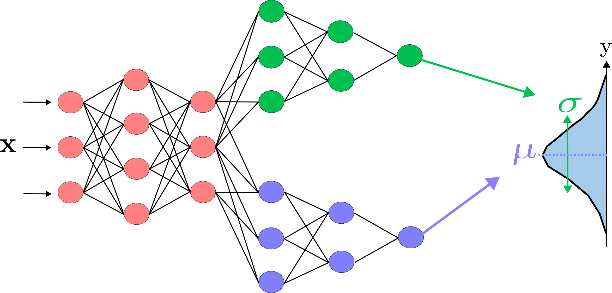</center>

In the image provided, the input data $\mathbf{x}$ is processed through a shared initial set of layers (in red), which then splits into two distinct pathways. The upper pathway (in green) is responsible for predicting the mean $\mu$. The lower pathway (in blue) is dedicated to predicting the standard deviation $\sigma$.By using these two networks, the model can capture varying levels of uncertainty across different regions of the input space. The uncertainty prediction network ensures that the standard deviation is not a fixed value but varies according to the input data, leading to more accurate and reliable uncertainty estimates. This dual-network approach allows the BNN to provide a comprehensive understanding of both the predicted target value and the associated uncertainty.

Having defined the BNN class and the layer class from the previously model, it’s relatively easy to define another class which implements the Two Heads Bayesian density network. We can just define a core network consisting of several layers (in red), and then two sub-networks which receive the output of the core network and output independent predictions. The output of one network we’ll use as the mean predictions, and the output of the other as the standard deviation predictions.


```python
class DualBNNRegressor(Model):
    """
    Multilayer fully-connected Bayesian neural network, with two heads to predict
    both the mean and the standard deviation of the output distribution.

    Parameters
    ----------
    units : List[int]
        Number of output dimensions for each layer in the core network.
    head_units : List[int]
        Number of output dimensions for each layer in the head networks.
    name : None or str
        Name for the layer.
    """

    def __init__(self, core_units, head_units, total_samples, name = None):
        # Initialize the parent class
        super(DualBNNRegressor, self).__init__(name = name)

        # Trackers for training metrics
        self.train_elbo_tracker = Mean(name='train_elbo')
        self.train_mae_tracker = MeanAbsoluteError(name='train_mae')

        # Trackers for validation metrics
        self.val_elbo_tracker = Mean(name='val_elbo')
        self.val_mae_tracker = MeanAbsoluteError(name='val_mae')

        # Create the core network using BayesianNN
        self.core_net = BNN( layer_units = core_units[:-1], 
                                    output_unit = core_units[-1], 
                                    activation_func = 'relu') 
        
        # Create the loc(mean) head network
        self.loc_net = BNN(  layer_units = [core_units[-1]] + head_units[:-1], 
                                    output_unit = head_units[-1],
                                    activation_func = 'relu')    

        # Create the scale (standard deviation) head network
        self.std_net = BNN(  layer_units = [core_units[-1]] + head_units[:-1], 
                                    output_unit = head_units[-1],  
                                    output_activation =  'softplus',
                                    activation_func = 'relu') 
        
        self.total_samples = total_samples
    
    def call(self, x, training = True):

        """
        Executes a forward pass through the network.

        Args:
            x (Tensor): The input tensor.

        Returns:
            Tensor: The output of the network after passing through all the layers.
        """
        # Pass the input through the core network
        x = self.core_net(x,  training = training)

        # Pass the output of the core network through the location and std heads
        loc_preds = self.loc_net(x,  training = training)
        std_preds = self.std_net(x,  training = training)
            
        # Return the output of the location and std heads
        return tf.concat([loc_preds, std_preds], 1)
    

    def train_step(self, data):
        x, y = data
        elbo_loss, preds = self._train_evaluate(x, y)
        y_loc_pred = preds[:, 0]

        self.train_mae_tracker.update_state(y, y_loc_pred)
        self.train_elbo_tracker.update_state(elbo_loss) 

        dict_losses = { "train_mae": self.train_mae_tracker.result(), 
                        "train_elbo":self.train_elbo_tracker.result()}
        return dict_losses
    
    @tf.function
    def _train_evaluate(self, x,  y):
        with tf.GradientTape() as tape:
            log_likelihoods, preds  = self.log_likelihood(x, y)
            elbo_loss = self.total_kl_loss/self.total_samples  - tf.reduce_mean(log_likelihoods)

        grads = tape.gradient(elbo_loss, self.trainable_weights)  
        if self.optimizer != None:
            self.optimizer.apply_gradients(zip(grads, self.trainable_weights))       

        return elbo_loss, preds
    
    def test_step(self, data):
        x, y = data
        elbo_loss, preds = self._test_evaluate(x, y)
        y_loc_pred = preds[:, 0]
        
        self.val_mae_tracker.update_state(y, y_loc_pred)
        self.val_elbo_tracker.update_state(elbo_loss) 

        dict_losses = { "mae": self.val_mae_tracker.result(), 
                        "elbo":self.val_elbo_tracker.result()}
        return dict_losses
    
    @tf.function
    def _test_evaluate(self, x, y):
        log_likelihoods, preds = self.log_likelihood(x, y, training=False)
        elbo_loss = self.total_kl_loss / self.total_samples - tf.reduce_mean(log_likelihoods)
        return elbo_loss, preds

     
    def log_likelihood(self, x, y, training = True):
        
        preds = self.call(x, training = training)
        # Ensure consistent dtypes
        loc = tf.cast(preds[:, 0], dtype=tf.float32)
        std = tf.cast(preds[:, 1], dtype=tf.float32)
        y = tf.cast(y[:, 0], dtype=tf.float32)
        
        log_likelihood = tfd.Normal(loc, std).log_prob(y)
        # Return log likelihood of true df_taxi given predictions
        return  log_likelihood, preds
    
    
    @tf.function
    def sample(self, x):
        preds = self.call(x)
        loc, std = preds[:, 0], preds[:, 1]
        return tfp.distributions.Normal(loc, std).sample()
    
    def samples(self, x, n_sample = 1):
        N = x.shape[0]
        samples = np.zeros((N, n_sample))

        for i in range(n_sample):
           samples[:,i] = self.sample(x)
        return samples
    
    @property
    def total_kl_loss(self):
        # KL-loss from the networks
        core_kl_loss = self.core_net.network_losses
        loc_kl_loss = self.loc_net.network_losses
        std_kl_loss = self.std_net.network_losses
        return core_kl_loss + loc_kl_loss + std_kl_loss
```


```python
# Initialize and compile the model
dual_bnn_regressor = DualBNNRegressor([1024, 512, 128], [64, 32, 1], X_train.shape[0])
dual_bnn_regressor.compile(optimizer=tf.keras.optimizers.Adam(learning_rate=1e-4))

# Train the model using the manually created datasets
dualbnn_history = dual_bnn_regressor.fit(X_train, Y_train[:, None], batch_size=1024, epochs=150, validation_data=(X_val, Y_val[:, None]), verbose=1)


# Save Model
dual_bnn_regressor.predict(X_test)
current_directory = os.getcwd()
save_dir = os.path.expanduser( current_directory + '/models/dual_bnn_regressor')
dual_bnn_regressor.save(save_dir)
```

    Epoch 1/150
    382/382 [==============================] - 45s 108ms/step - train_mae: 0.5348 - train_elbo: 10.2264 - val_mae: 0.4071 - val_elbo: 9.8879
    Epoch 2/150
    382/382 [==============================] - 40s 105ms/step - train_mae: 0.3995 - train_elbo: 9.8348 - val_mae: 0.3921 - val_elbo: 9.7848
    Epoch 3/150
    382/382 [==============================] - 40s 105ms/step - train_mae: 0.3906 - train_elbo: 9.7540 - val_mae: 0.3872 - val_elbo: 9.7205
    Epoch 4/150
    382/382 [==============================] - 40s 105ms/step - train_mae: 0.3861 - train_elbo: 9.6880 - val_mae: 0.3820 - val_elbo: 9.6550
    Epoch 5/150
    382/382 [==============================] - 40s 105ms/step - train_mae: 0.3824 - train_elbo: 9.6254 - val_mae: 0.3823 - val_elbo: 9.6032
    Epoch 6/150
    382/382 [==============================] - 40s 105ms/step - train_mae: 0.3810 - train_elbo: 9.5695 - val_mae: 0.3781 - val_elbo: 9.5353
    Epoch 7/150
    382/382 [==============================] - 40s 105ms/step - train_mae: 0.3792 - train_elbo: 9.5138 - val_mae: 0.3776 - val_elbo: 9.4855
    Epoch 8/150
    382/382 [==============================] - 40s 105ms/step - train_mae: 0.3776 - train_elbo: 9.4593 - val_mae: 0.3773 - val_elbo: 9.4332
    Epoch 9/150
    382/382 [==============================] - 40s 105ms/step - train_mae: 0.3767 - train_elbo: 9.4066 - val_mae: 0.3748 - val_elbo: 9.3779
    Epoch 10/150
    382/382 [==============================] - 40s 106ms/step - train_mae: 0.3754 - train_elbo: 9.3537 - val_mae: 0.3736 - val_elbo: 9.3261
    Epoch 11/150
    382/382 [==============================] - 41s 106ms/step - train_mae: 0.3750 - train_elbo: 9.3035 - val_mae: 0.3740 - val_elbo: 9.2800
    Epoch 12/150
    382/382 [==============================] - 40s 106ms/step - train_mae: 0.3739 - train_elbo: 9.2519 - val_mae: 0.3756 - val_elbo: 9.2356
    Epoch 13/150
    382/382 [==============================] - 40s 105ms/step - train_mae: 0.3730 - train_elbo: 9.2015 - val_mae: 0.3720 - val_elbo: 9.1743
    Epoch 14/150
    382/382 [==============================] - 40s 104ms/step - train_mae: 0.3728 - train_elbo: 9.1532 - val_mae: 0.3715 - val_elbo: 9.1273
    Epoch 15/150
    382/382 [==============================] - 40s 104ms/step - train_mae: 0.3721 - train_elbo: 9.1039 - val_mae: 0.3732 - val_elbo: 9.0810
    Epoch 16/150
    382/382 [==============================] - 40s 105ms/step - train_mae: 0.3719 - train_elbo: 9.0566 - val_mae: 0.3701 - val_elbo: 9.0306
    Epoch 17/150
    382/382 [==============================] - 41s 106ms/step - train_mae: 0.3714 - train_elbo: 9.0094 - val_mae: 0.3729 - val_elbo: 8.9885
    Epoch 18/150
    382/382 [==============================] - 40s 106ms/step - train_mae: 0.3710 - train_elbo: 8.9616 - val_mae: 0.3711 - val_elbo: 8.9425
    Epoch 19/150
    382/382 [==============================] - 40s 105ms/step - train_mae: 0.3704 - train_elbo: 8.9142 - val_mae: 0.3707 - val_elbo: 8.8932
    Epoch 20/150
    382/382 [==============================] - 40s 106ms/step - train_mae: 0.3703 - train_elbo: 8.8686 - val_mae: 0.3712 - val_elbo: 8.8469
    Epoch 21/150
    382/382 [==============================] - 40s 106ms/step - train_mae: 0.3698 - train_elbo: 8.8223 - val_mae: 0.3691 - val_elbo: 8.7982
    Epoch 22/150
    382/382 [==============================] - 40s 105ms/step - train_mae: 0.3693 - train_elbo: 8.7755 - val_mae: 0.3684 - val_elbo: 8.7577
    Epoch 23/150
    382/382 [==============================] - 40s 104ms/step - train_mae: 0.3691 - train_elbo: 8.7313 - val_mae: 0.3684 - val_elbo: 8.7095
    Epoch 24/150
    382/382 [==============================] - 40s 104ms/step - train_mae: 0.3686 - train_elbo: 8.6863 - val_mae: 0.3700 - val_elbo: 8.6703
    Epoch 25/150
    382/382 [==============================] - 40s 106ms/step - train_mae: 0.3688 - train_elbo: 8.6422 - val_mae: 0.3682 - val_elbo: 8.6238
    Epoch 26/150
    382/382 [==============================] - 40s 105ms/step - train_mae: 0.3685 - train_elbo: 8.5985 - val_mae: 0.3685 - val_elbo: 8.5827
    Epoch 27/150
    382/382 [==============================] - 41s 106ms/step - train_mae: 0.3677 - train_elbo: 8.5534 - val_mae: 0.3749 - val_elbo: 8.5482
    Epoch 28/150
    382/382 [==============================] - 41s 106ms/step - train_mae: 0.3679 - train_elbo: 8.5110 - val_mae: 0.3683 - val_elbo: 8.4917
    Epoch 29/150
    382/382 [==============================] - 40s 105ms/step - train_mae: 0.3676 - train_elbo: 8.4678 - val_mae: 0.3690 - val_elbo: 8.4535
    Epoch 30/150
    382/382 [==============================] - 40s 106ms/step - train_mae: 0.3675 - train_elbo: 8.4251 - val_mae: 0.3679 - val_elbo: 8.4105
    Epoch 31/150
    382/382 [==============================] - 40s 105ms/step - train_mae: 0.3671 - train_elbo: 8.3822 - val_mae: 0.3665 - val_elbo: 8.3654
    Epoch 32/150
    382/382 [==============================] - 40s 106ms/step - train_mae: 0.3670 - train_elbo: 8.3402 - val_mae: 0.3669 - val_elbo: 8.3223
    Epoch 33/150
    382/382 [==============================] - 40s 105ms/step - train_mae: 0.3669 - train_elbo: 8.2984 - val_mae: 0.3676 - val_elbo: 8.2842
    Epoch 34/150
    382/382 [==============================] - 40s 105ms/step - train_mae: 0.3667 - train_elbo: 8.2568 - val_mae: 0.3682 - val_elbo: 8.2455
    Epoch 35/150
    382/382 [==============================] - 40s 105ms/step - train_mae: 0.3663 - train_elbo: 8.2150 - val_mae: 0.3662 - val_elbo: 8.1977
    Epoch 36/150
    382/382 [==============================] - 40s 105ms/step - train_mae: 0.3663 - train_elbo: 8.1746 - val_mae: 0.3672 - val_elbo: 8.1594
    Epoch 37/150
    382/382 [==============================] - 41s 108ms/step - train_mae: 0.3661 - train_elbo: 8.1342 - val_mae: 0.3666 - val_elbo: 8.1178
    Epoch 38/150
    382/382 [==============================] - 41s 108ms/step - train_mae: 0.3660 - train_elbo: 8.0940 - val_mae: 0.3679 - val_elbo: 8.0815
    Epoch 39/150
    382/382 [==============================] - 40s 105ms/step - train_mae: 0.3662 - train_elbo: 8.0548 - val_mae: 0.3690 - val_elbo: 8.0454
    Epoch 40/150
    382/382 [==============================] - 40s 105ms/step - train_mae: 0.3657 - train_elbo: 8.0145 - val_mae: 0.3661 - val_elbo: 7.9999
    Epoch 41/150
    382/382 [==============================] - 40s 105ms/step - train_mae: 0.3659 - train_elbo: 7.9764 - val_mae: 0.3654 - val_elbo: 7.9611
    Epoch 42/150
    382/382 [==============================] - 41s 107ms/step - train_mae: 0.3656 - train_elbo: 7.9368 - val_mae: 0.3656 - val_elbo: 7.9228
    Epoch 43/150
    382/382 [==============================] - 40s 106ms/step - train_mae: 0.3654 - train_elbo: 7.8983 - val_mae: 0.3667 - val_elbo: 7.8884
    Epoch 44/150
    382/382 [==============================] - 40s 105ms/step - train_mae: 0.3654 - train_elbo: 7.8601 - val_mae: 0.3663 - val_elbo: 7.8512
    Epoch 45/150
    382/382 [==============================] - 40s 105ms/step - train_mae: 0.3652 - train_elbo: 7.8218 - val_mae: 0.3661 - val_elbo: 7.8100
    Epoch 46/150
    382/382 [==============================] - 40s 104ms/step - train_mae: 0.3648 - train_elbo: 7.7832 - val_mae: 0.3650 - val_elbo: 7.7703
    Epoch 47/150
    382/382 [==============================] - 40s 105ms/step - train_mae: 0.3651 - train_elbo: 7.7462 - val_mae: 0.3652 - val_elbo: 7.7353
    Epoch 48/150
    382/382 [==============================] - 40s 105ms/step - train_mae: 0.3649 - train_elbo: 7.7092 - val_mae: 0.3653 - val_elbo: 7.6979
    Epoch 49/150
    382/382 [==============================] - 40s 105ms/step - train_mae: 0.3646 - train_elbo: 7.6716 - val_mae: 0.3657 - val_elbo: 7.6603
    Epoch 50/150
    382/382 [==============================] - 40s 104ms/step - train_mae: 0.3646 - train_elbo: 7.6349 - val_mae: 0.3655 - val_elbo: 7.6246
    Epoch 51/150
    382/382 [==============================] - 40s 105ms/step - train_mae: 0.3646 - train_elbo: 7.5986 - val_mae: 0.3651 - val_elbo: 7.5876
    Epoch 52/150
    382/382 [==============================] - 40s 106ms/step - train_mae: 0.3645 - train_elbo: 7.5628 - val_mae: 0.3656 - val_elbo: 7.5524
    Epoch 53/150
    382/382 [==============================] - 41s 106ms/step - train_mae: 0.3645 - train_elbo: 7.5264 - val_mae: 0.3657 - val_elbo: 7.5184
    Epoch 54/150
    382/382 [==============================] - 40s 105ms/step - train_mae: 0.3644 - train_elbo: 7.4913 - val_mae: 0.3668 - val_elbo: 7.4846
    Epoch 55/150
    382/382 [==============================] - 40s 105ms/step - train_mae: 0.3642 - train_elbo: 7.4556 - val_mae: 0.3656 - val_elbo: 7.4461
    Epoch 56/150
    382/382 [==============================] - 40s 105ms/step - train_mae: 0.3641 - train_elbo: 7.4200 - val_mae: 0.3658 - val_elbo: 7.4116
    Epoch 57/150
    382/382 [==============================] - 40s 104ms/step - train_mae: 0.3641 - train_elbo: 7.3859 - val_mae: 0.3654 - val_elbo: 7.3781
    Epoch 58/150
    382/382 [==============================] - 40s 105ms/step - train_mae: 0.3639 - train_elbo: 7.3508 - val_mae: 0.3663 - val_elbo: 7.3471
    Epoch 59/150
    382/382 [==============================] - 40s 106ms/step - train_mae: 0.3639 - train_elbo: 7.3173 - val_mae: 0.3649 - val_elbo: 7.3079
    Epoch 60/150
    382/382 [==============================] - 40s 105ms/step - train_mae: 0.3637 - train_elbo: 7.2826 - val_mae: 0.3649 - val_elbo: 7.2757
    Epoch 61/150
    382/382 [==============================] - 40s 105ms/step - train_mae: 0.3639 - train_elbo: 7.2492 - val_mae: 0.3645 - val_elbo: 7.2394
    Epoch 62/150
    382/382 [==============================] - 41s 106ms/step - train_mae: 0.3637 - train_elbo: 7.2154 - val_mae: 0.3649 - val_elbo: 7.2060
    Epoch 63/150
    382/382 [==============================] - 41s 106ms/step - train_mae: 0.3637 - train_elbo: 7.1827 - val_mae: 0.3654 - val_elbo: 7.1771
    Epoch 64/150
    382/382 [==============================] - 40s 105ms/step - train_mae: 0.3635 - train_elbo: 7.1486 - val_mae: 0.3657 - val_elbo: 7.1433
    Epoch 65/150
    382/382 [==============================] - 40s 105ms/step - train_mae: 0.3636 - train_elbo: 7.1161 - val_mae: 0.3653 - val_elbo: 7.1082
    Epoch 66/150
    382/382 [==============================] - 40s 104ms/step - train_mae: 0.3637 - train_elbo: 7.0844 - val_mae: 0.3651 - val_elbo: 7.0764
    Epoch 67/150
    382/382 [==============================] - 40s 104ms/step - train_mae: 0.3634 - train_elbo: 7.0514 - val_mae: 0.3643 - val_elbo: 7.0452
    Epoch 68/150
    382/382 [==============================] - 40s 105ms/step - train_mae: 0.3633 - train_elbo: 7.0186 - val_mae: 0.3648 - val_elbo: 7.0118
    Epoch 69/150
    382/382 [==============================] - 41s 107ms/step - train_mae: 0.3635 - train_elbo: 6.9875 - val_mae: 0.3638 - val_elbo: 6.9777
    Epoch 70/150
    382/382 [==============================] - 40s 106ms/step - train_mae: 0.3632 - train_elbo: 6.9549 - val_mae: 0.3638 - val_elbo: 6.9491
    Epoch 71/150
    382/382 [==============================] - 40s 105ms/step - train_mae: 0.3632 - train_elbo: 6.9239 - val_mae: 0.3646 - val_elbo: 6.9200
    Epoch 72/150
    382/382 [==============================] - 40s 106ms/step - train_mae: 0.3636 - train_elbo: 6.8937 - val_mae: 0.3644 - val_elbo: 6.8883
    Epoch 73/150
    382/382 [==============================] - 41s 106ms/step - train_mae: 0.3633 - train_elbo: 6.8618 - val_mae: 0.3635 - val_elbo: 6.8539
    Epoch 74/150
    382/382 [==============================] - 40s 105ms/step - train_mae: 0.3630 - train_elbo: 6.8303 - val_mae: 0.3643 - val_elbo: 6.8241
    Epoch 75/150
    382/382 [==============================] - 40s 104ms/step - train_mae: 0.3632 - train_elbo: 6.8002 - val_mae: 0.3647 - val_elbo: 6.7958
    Epoch 76/150
    382/382 [==============================] - 40s 104ms/step - train_mae: 0.3631 - train_elbo: 6.7700 - val_mae: 0.3648 - val_elbo: 6.7651
    Epoch 77/150
    382/382 [==============================] - 40s 105ms/step - train_mae: 0.3630 - train_elbo: 6.7391 - val_mae: 0.3643 - val_elbo: 6.7353
    Epoch 78/150
    382/382 [==============================] - 40s 106ms/step - train_mae: 0.3628 - train_elbo: 6.7086 - val_mae: 0.3633 - val_elbo: 6.7014
    Epoch 79/150
    382/382 [==============================] - 41s 107ms/step - train_mae: 0.3632 - train_elbo: 6.6800 - val_mae: 0.3631 - val_elbo: 6.6722
    Epoch 80/150
    382/382 [==============================] - 41s 107ms/step - train_mae: 0.3628 - train_elbo: 6.6494 - val_mae: 0.3636 - val_elbo: 6.6429
    Epoch 81/150
    382/382 [==============================] - 40s 106ms/step - train_mae: 0.3631 - train_elbo: 6.6204 - val_mae: 0.3639 - val_elbo: 6.6144
    Epoch 82/150
    382/382 [==============================] - 40s 105ms/step - train_mae: 0.3629 - train_elbo: 6.5906 - val_mae: 0.3631 - val_elbo: 6.5838
    Epoch 83/150
    382/382 [==============================] - 40s 105ms/step - train_mae: 0.3629 - train_elbo: 6.5608 - val_mae: 0.3630 - val_elbo: 6.5539
    Epoch 84/150
    382/382 [==============================] - 40s 105ms/step - train_mae: 0.3630 - train_elbo: 6.5332 - val_mae: 0.3651 - val_elbo: 6.5323
    Epoch 85/150
    382/382 [==============================] - 40s 105ms/step - train_mae: 0.3629 - train_elbo: 6.5038 - val_mae: 0.3636 - val_elbo: 6.5003
    Epoch 86/150
    382/382 [==============================] - 40s 105ms/step - train_mae: 0.3627 - train_elbo: 6.4745 - val_mae: 0.3642 - val_elbo: 6.4710
    Epoch 87/150
    382/382 [==============================] - 40s 106ms/step - train_mae: 0.3628 - train_elbo: 6.4460 - val_mae: 0.3637 - val_elbo: 6.4435
    Epoch 88/150
    382/382 [==============================] - 40s 106ms/step - train_mae: 0.3628 - train_elbo: 6.4184 - val_mae: 0.3640 - val_elbo: 6.4123
    Epoch 89/150
    382/382 [==============================] - 41s 106ms/step - train_mae: 0.3628 - train_elbo: 6.3896 - val_mae: 0.3641 - val_elbo: 6.3878
    Epoch 90/150
    382/382 [==============================] - 41s 106ms/step - train_mae: 0.3628 - train_elbo: 6.3619 - val_mae: 0.3631 - val_elbo: 6.3549
    Epoch 91/150
    382/382 [==============================] - 40s 105ms/step - train_mae: 0.3627 - train_elbo: 6.3343 - val_mae: 0.3635 - val_elbo: 6.3290
    Epoch 92/150
    382/382 [==============================] - 40s 104ms/step - train_mae: 0.3626 - train_elbo: 6.3060 - val_mae: 0.3630 - val_elbo: 6.3018
    Epoch 93/150
    382/382 [==============================] - 40s 105ms/step - train_mae: 0.3627 - train_elbo: 6.2794 - val_mae: 0.3631 - val_elbo: 6.2746
    Epoch 94/150
    382/382 [==============================] - 41s 106ms/step - train_mae: 0.3629 - train_elbo: 6.2522 - val_mae: 0.3641 - val_elbo: 6.2483
    Epoch 95/150
    382/382 [==============================] - 41s 106ms/step - train_mae: 0.3628 - train_elbo: 6.2250 - val_mae: 0.3642 - val_elbo: 6.2202
    Epoch 96/150
    382/382 [==============================] - 40s 106ms/step - train_mae: 0.3626 - train_elbo: 6.1979 - val_mae: 0.3635 - val_elbo: 6.1954
    Epoch 97/150
    382/382 [==============================] - 40s 106ms/step - train_mae: 0.3627 - train_elbo: 6.1712 - val_mae: 0.3636 - val_elbo: 6.1662
    Epoch 98/150
    382/382 [==============================] - 40s 105ms/step - train_mae: 0.3626 - train_elbo: 6.1441 - val_mae: 0.3650 - val_elbo: 6.1401
    Epoch 99/150
    382/382 [==============================] - 40s 106ms/step - train_mae: 0.3627 - train_elbo: 6.1176 - val_mae: 0.3629 - val_elbo: 6.1115
    Epoch 100/150
    382/382 [==============================] - 40s 106ms/step - train_mae: 0.3626 - train_elbo: 6.0910 - val_mae: 0.3633 - val_elbo: 6.0858
    Epoch 101/150
    382/382 [==============================] - 40s 106ms/step - train_mae: 0.3626 - train_elbo: 6.0645 - val_mae: 0.3631 - val_elbo: 6.0604
    Epoch 102/150
    382/382 [==============================] - 40s 104ms/step - train_mae: 0.3625 - train_elbo: 6.0382 - val_mae: 0.3631 - val_elbo: 6.0355
    Epoch 103/150
    382/382 [==============================] - 40s 106ms/step - train_mae: 0.3626 - train_elbo: 6.0126 - val_mae: 0.3636 - val_elbo: 6.0071
    Epoch 104/150
    382/382 [==============================] - 41s 107ms/step - train_mae: 0.3628 - train_elbo: 5.9865 - val_mae: 0.3640 - val_elbo: 5.9823
    Epoch 105/150
    382/382 [==============================] - 41s 106ms/step - train_mae: 0.3625 - train_elbo: 5.9603 - val_mae: 0.3647 - val_elbo: 5.9559
    Epoch 106/150
    382/382 [==============================] - 40s 105ms/step - train_mae: 0.3627 - train_elbo: 5.9349 - val_mae: 0.3625 - val_elbo: 5.9286
    Epoch 107/150
    382/382 [==============================] - 40s 105ms/step - train_mae: 0.3629 - train_elbo: 5.9096 - val_mae: 0.3625 - val_elbo: 5.9034
    Epoch 108/150
    382/382 [==============================] - 40s 105ms/step - train_mae: 0.3624 - train_elbo: 5.8828 - val_mae: 0.3632 - val_elbo: 5.8782
    Epoch 109/150
    382/382 [==============================] - 40s 105ms/step - train_mae: 0.3626 - train_elbo: 5.8582 - val_mae: 0.3631 - val_elbo: 5.8526
    Epoch 110/150
    382/382 [==============================] - 40s 106ms/step - train_mae: 0.3624 - train_elbo: 5.8320 - val_mae: 0.3635 - val_elbo: 5.8283
    Epoch 111/150
    382/382 [==============================] - 40s 105ms/step - train_mae: 0.3625 - train_elbo: 5.8071 - val_mae: 0.3630 - val_elbo: 5.8023
    Epoch 112/150
    382/382 [==============================] - 40s 105ms/step - train_mae: 0.3628 - train_elbo: 5.7831 - val_mae: 0.3630 - val_elbo: 5.7766
    Epoch 113/150
    382/382 [==============================] - 40s 105ms/step - train_mae: 0.3627 - train_elbo: 5.7578 - val_mae: 0.3640 - val_elbo: 5.7538
    Epoch 114/150
    382/382 [==============================] - 40s 106ms/step - train_mae: 0.3626 - train_elbo: 5.7326 - val_mae: 0.3628 - val_elbo: 5.7276
    Epoch 115/150
    382/382 [==============================] - 41s 107ms/step - train_mae: 0.3625 - train_elbo: 5.7079 - val_mae: 0.3624 - val_elbo: 5.7044
    Epoch 116/150
    382/382 [==============================] - 40s 106ms/step - train_mae: 0.3626 - train_elbo: 5.6837 - val_mae: 0.3633 - val_elbo: 5.6797
    Epoch 117/150
    382/382 [==============================] - 40s 106ms/step - train_mae: 0.3627 - train_elbo: 5.6597 - val_mae: 0.3630 - val_elbo: 5.6534
    Epoch 118/150
    382/382 [==============================] - 40s 105ms/step - train_mae: 0.3624 - train_elbo: 5.6343 - val_mae: 0.3653 - val_elbo: 5.6319
    Epoch 119/150
    382/382 [==============================] - 40s 105ms/step - train_mae: 0.3627 - train_elbo: 5.6108 - val_mae: 0.3636 - val_elbo: 5.6074
    Epoch 120/150
    382/382 [==============================] - 40s 105ms/step - train_mae: 0.3625 - train_elbo: 5.5861 - val_mae: 0.3634 - val_elbo: 5.5821
    Epoch 121/150
    382/382 [==============================] - 40s 105ms/step - train_mae: 0.3627 - train_elbo: 5.5627 - val_mae: 0.3639 - val_elbo: 5.5582
    Epoch 122/150
    382/382 [==============================] - 40s 104ms/step - train_mae: 0.3624 - train_elbo: 5.5380 - val_mae: 0.3635 - val_elbo: 5.5365
    Epoch 123/150
    382/382 [==============================] - 40s 104ms/step - train_mae: 0.3626 - train_elbo: 5.5148 - val_mae: 0.3626 - val_elbo: 5.5105
    Epoch 124/150
    382/382 [==============================] - 40s 105ms/step - train_mae: 0.3625 - train_elbo: 5.4913 - val_mae: 0.3629 - val_elbo: 5.4858
    Epoch 125/150
    382/382 [==============================] - 41s 107ms/step - train_mae: 0.3625 - train_elbo: 5.4672 - val_mae: 0.3625 - val_elbo: 5.4616
    Epoch 126/150
    382/382 [==============================] - 40s 106ms/step - train_mae: 0.3626 - train_elbo: 5.4433 - val_mae: 0.3623 - val_elbo: 5.4367
    Epoch 127/150
    382/382 [==============================] - 40s 105ms/step - train_mae: 0.3626 - train_elbo: 5.4197 - val_mae: 0.3639 - val_elbo: 5.4160
    Epoch 128/150
    382/382 [==============================] - 40s 105ms/step - train_mae: 0.3627 - train_elbo: 5.3960 - val_mae: 0.3627 - val_elbo: 5.3917
    Epoch 129/150
    382/382 [==============================] - 40s 106ms/step - train_mae: 0.3626 - train_elbo: 5.3724 - val_mae: 0.3637 - val_elbo: 5.3680
    Epoch 130/150
    382/382 [==============================] - 40s 106ms/step - train_mae: 0.3625 - train_elbo: 5.3490 - val_mae: 0.3630 - val_elbo: 5.3458
    Epoch 131/150
    382/382 [==============================] - 40s 105ms/step - train_mae: 0.3625 - train_elbo: 5.3260 - val_mae: 0.3627 - val_elbo: 5.3207
    Epoch 132/150
    382/382 [==============================] - 40s 105ms/step - train_mae: 0.3625 - train_elbo: 5.3028 - val_mae: 0.3625 - val_elbo: 5.2977
    Epoch 133/150
    382/382 [==============================] - 40s 104ms/step - train_mae: 0.3622 - train_elbo: 5.2796 - val_mae: 0.3630 - val_elbo: 5.2749
    Epoch 134/150
    382/382 [==============================] - 40s 106ms/step - train_mae: 0.3625 - train_elbo: 5.2569 - val_mae: 0.3621 - val_elbo: 5.2520
    Epoch 135/150
    382/382 [==============================] - 41s 107ms/step - train_mae: 0.3626 - train_elbo: 5.2345 - val_mae: 0.3626 - val_elbo: 5.2281
    Epoch 136/150
    382/382 [==============================] - 41s 106ms/step - train_mae: 0.3626 - train_elbo: 5.2115 - val_mae: 0.3625 - val_elbo: 5.2066
    Epoch 137/150
    382/382 [==============================] - 40s 105ms/step - train_mae: 0.3629 - train_elbo: 5.1896 - val_mae: 0.3627 - val_elbo: 5.1852
    Epoch 138/150
    382/382 [==============================] - 40s 105ms/step - train_mae: 0.3625 - train_elbo: 5.1660 - val_mae: 0.3626 - val_elbo: 5.1615
    Epoch 139/150
    382/382 [==============================] - 40s 106ms/step - train_mae: 0.3626 - train_elbo: 5.1430 - val_mae: 0.3628 - val_elbo: 5.1392
    Epoch 140/150
    382/382 [==============================] - 40s 105ms/step - train_mae: 0.3626 - train_elbo: 5.1211 - val_mae: 0.3627 - val_elbo: 5.1157
    Epoch 141/150
    382/382 [==============================] - 40s 105ms/step - train_mae: 0.3626 - train_elbo: 5.0990 - val_mae: 0.3638 - val_elbo: 5.0974
    Epoch 142/150
    382/382 [==============================] - 40s 106ms/step - train_mae: 0.3628 - train_elbo: 5.0765 - val_mae: 0.3631 - val_elbo: 5.0711
    Epoch 143/150
    382/382 [==============================] - 40s 105ms/step - train_mae: 0.3628 - train_elbo: 5.0542 - val_mae: 0.3630 - val_elbo: 5.0492
    Epoch 144/150
    382/382 [==============================] - 40s 106ms/step - train_mae: 0.3627 - train_elbo: 5.0315 - val_mae: 0.3631 - val_elbo: 5.0287
    Epoch 145/150
    382/382 [==============================] - 41s 107ms/step - train_mae: 0.3626 - train_elbo: 5.0096 - val_mae: 0.3619 - val_elbo: 5.0038
    Epoch 146/150
    382/382 [==============================] - 41s 107ms/step - train_mae: 0.3628 - train_elbo: 4.9882 - val_mae: 0.3620 - val_elbo: 4.9823
    Epoch 147/150
    382/382 [==============================] - 40s 106ms/step - train_mae: 0.3626 - train_elbo: 4.9657 - val_mae: 0.3624 - val_elbo: 4.9592
    Epoch 148/150
    382/382 [==============================] - 40s 105ms/step - train_mae: 0.3625 - train_elbo: 4.9433 - val_mae: 0.3635 - val_elbo: 4.9396
    Epoch 149/150
    382/382 [==============================] - 40s 104ms/step - train_mae: 0.3626 - train_elbo: 4.9209 - val_mae: 0.3627 - val_elbo: 4.9158
    Epoch 150/150
    382/382 [==============================] - 40s 104ms/step - train_mae: 0.3626 - train_elbo: 4.9003 - val_mae: 0.3620 - val_elbo: 4.8932
    12202/12202 [==============================] - 13s 1ms/step
    INFO:tensorflow:Assets written to: /home/marcos/GitHub/bayesian-neural-network/02-regression/models/dual_bnn_regressor/assets


    INFO:tensorflow:Assets written to: /home/marcos/GitHub/bayesian-neural-network/02-regression/models/dual_bnn_regressor/assets


```python
fig, axs = plt.subplots(1, 2, figsize=(15, 6))

axs[0].plot(dualbnn_history.history['train_mae'], color='black', label='Train')
axs[0].plot(dualbnn_history.history['val_mae'], color='#d08f10ff', label='Validation')
axs[0].set_xlabel('Epoch')
axs[0].set_ylabel('Mean Absolute Error')
axs[0].set_title('MAE vs Epochs')
axs[0].legend()
axs[0].grid()

axs[1].plot(dualbnn_history.history['train_elbo'], color='black', label='Train')
axs[1].plot(dualbnn_history.history['val_elbo'], color='#d08f10ff', label='Validation')
axs[1].set_xlabel('Epoch')
axs[1].set_ylabel('ELBO')
axs[1].set_title('ELBO vs Epochs')
axs[1].legend()
axs[1].grid()


plt.show()
```


    
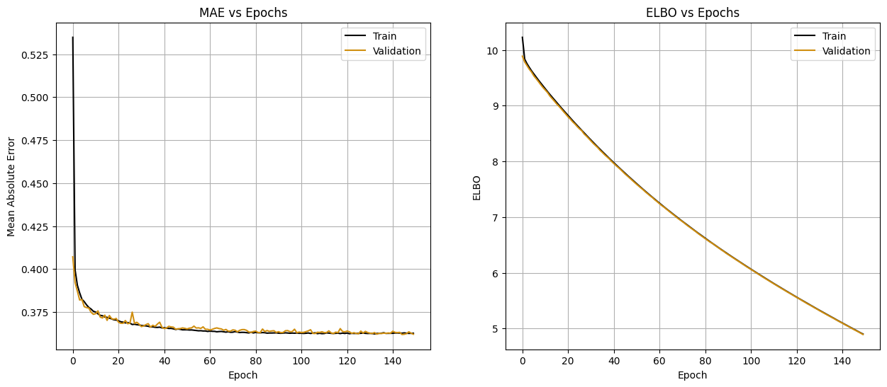
    


```python
dual_bnn_preds = dual_bnn_regressor.predict(X_test)

# distributions plot
plt.figure(figsize=(16, 6))

# KDE plot for residuals
plt.subplot(1, 2, 1)
sns.kdeplot(Y_test, fill=True, color="#dfdc7bff" , alpha=0.5, label='True')
sns.kdeplot(dual_bnn_preds[:, 0], fill=True, color="#d08f10ff",  label='Predicted')
plt.legend()
plt.ylabel('Density')
plt.title('Distribution (KDE)')
plt.grid()
plt.xlim(-2, 2)

# CDF plot
plt.subplot(1, 2, 2)
sns.kdeplot(Y_test, cumulative=True, color="#dfdc7bff", linewidth=2, label='True')
sns.kdeplot(dual_bnn_preds[:, 0], cumulative=True, color="#d08f10ff", linewidth=2,  label='Predicted')
plt.legend()
plt.ylabel('CDF')
plt.title('Cumulative Distribution (CDF)')
plt.grid()
plt.xlim(-2, 2)

plt.tight_layout()
plt.show()
```

    12202/12202 [==============================] - 20s 2ms/step


    
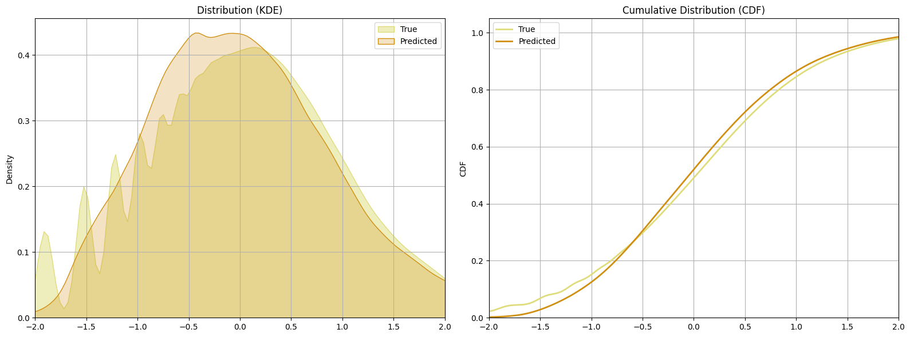
    


# Conclusion

Now let's compare the models we trained in terms of their predictive performance and their uncertainty estimates.


```python
# Load Models
current_directory = os.getcwd()
nn_path = os.path.expanduser( current_directory + '/models/nn_regressor')
bnn_path = os.path.expanduser( current_directory + '/models/bnn_regressor')
dual_bnn_path = os.path.expanduser( current_directory + '/models/dual_bnn_regressor')


nn_regressor = tf.keras.models.load_model(nn_path, custom_objects={'NNRegressor': NNRegressor})
bnn_regressor = tf.keras.models.load_model(bnn_path, custom_objects={'DenseFlipout': DenseFlipout, 'BNN': BNN, 'BNNRegressor': BNNRegressor})
dual_bnn_regressor = tf.keras.models.load_model(dual_bnn_path, custom_objects={'DenseFlipout': DenseFlipout, 'BNN': BNN, 'DualBNNRegressor': DualBNNRegressor})

```

    WARNING:absl:Importing a function (__inference_internal_grad_fn_1926818) with ops with unsaved custom gradients. Will likely fail if a gradient is requested.
    WARNING:absl:Importing a function (__inference_internal_grad_fn_3070053) with ops with unsaved custom gradients. Will likely fail if a gradient is requested.


## Learning Curves

The learning curves is very close, with the Dual BNN having the lower error.


```python
# Plot error vs epoch curves for all 3 models
plt.plot(nn_history.history['val_loss'], color="black", label='NN')
plt.plot(bnn_history.history['val_mae'],color="#dfdc7bff" ,   label='BNN')
plt.plot(dualbnn_history.history['val_mae'],color="#d08f10ff" ,  label='Dual BNN')
plt.title('MAE vs Epochs')
plt.legend()
plt.xlabel('Epoch')
plt.ylabel('Mean Absolute Error')
plt.grid()
plt.show()

```


    
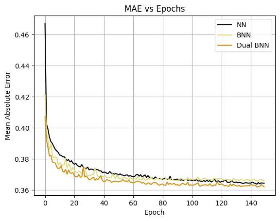
    


## Residuals

The plots display the residual distributions for two different models: a simple Bayesian neural network (BNN) and a Two Heads Bayesian neural network (Dual BNN). Residuals are the differences between the true values and the predicted values for each model.


```python
bnn_pred_test= bnn_regressor.predict(X_test)
dual_bnn_pred_test = dual_bnn_regressor.predict(X_test)

# Calculate residuals
resids1 = Y_test - bnn_pred_test[:, 0]
resids2 = Y_test - dual_bnn_pred_test[:, 0]

# Plot residual distributions using KDE and CDF
plt.figure(figsize=(16, 6))

# KDE plot for residuals
plt.subplot(1, 2, 1)
sns.kdeplot(resids1, fill=True, color="#dfdc7bff" , alpha=0.5, label='BNN')
sns.kdeplot(resids2, fill=True, color="#d08f10ff", label='Dual BNN')
plt.legend()
plt.xlabel('Residuals')
plt.ylabel('Density')
plt.title('Residual Distributions (KDE)')
plt.grid()
plt.xlim(-2, 2)

# CDF plot for residuals
plt.subplot(1, 2, 2)
sns.kdeplot(resids1, cumulative=True, color="#dfdc7bff", linewidth=2, label='BNN')
sns.kdeplot(resids2, cumulative=True, color="#d08f10ff", linewidth=2, label='Dual BNN')
plt.legend()
plt.xlabel('Residuals')
plt.ylabel('CDF')
plt.title('Residual Distributions (CDF)')
plt.grid()
plt.xlim(-2, 2)

plt.tight_layout()
plt.show()
```

    12202/12202 [==============================] - 18s 1ms/step
    12202/12202 [==============================] - 17s 1ms/step


    
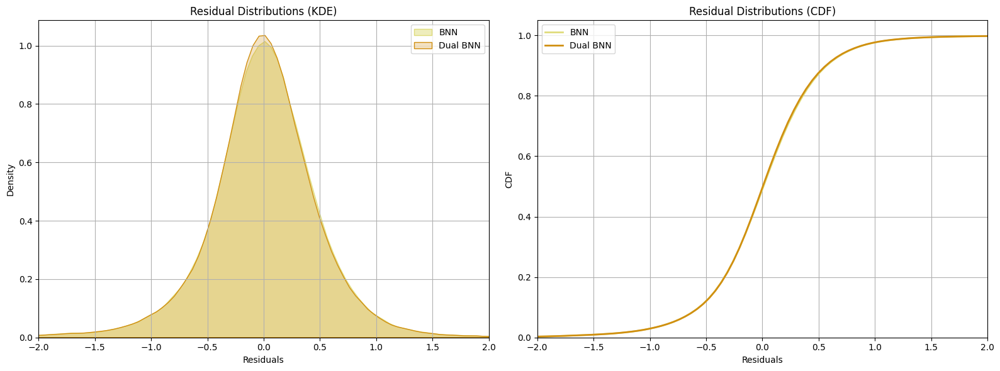
    


The close overlap of the distributions indicates that the residuals from both models are similar. This similarity is expected because both models use the same network structure for predicting the mean values, even though their weights may differ. The alignment between the BNN and Dual BNN mean predictions indicates that both models are capturing the underlying patterns in the data similarly.

# Predictive Distributions

The sampling process in Bayesian neural networks involves drawing samples from the posterior distribution of the network's weights. This allows us to capture the uncertainty in the model's predictions. During prediction, we draw samples from the posterior distribution of the weights.

For each input data point, we generate multiple predictions by sampling different sets of weights from the posterior distribution. The resulting set of predictions forms a predictive distribution, which reflects the model's uncertainty about the prediction. Each sample of weights results in a different prediction for the same input data. This process captures the variability in the model's predictions due to uncertainty in the weights.

To understand the predictive distributions of the Bayesian neural network (BNN) and the Two Heads Bayesian neural network (Dual BNN), we sample predictions for a subset of the test data as follows:


```python
# Sample a subset of the test data
subset_size = 100000  # Using a smaller subset
indices = np.random.choice(len(X_test), subset_size, replace=False)
X_test_subset = X_test[indices]
Y_test_subset = Y_test[indices]

# Create the dataset for the subset
dataset = tf.data.Dataset.from_tensor_slices(X_test_subset).batch(subset_size)

# Iterate through the dataset batches with progress bar
for batch in tqdm(dataset, desc="Processing Batches"):
    bnn_samples = bnn_regressor.samples(batch, n_sample=1000)
    dual_bnn_samples = dual_bnn_regressor.samples(batch, n_sample=1000)
```

    Processing Batches:   0%|          | 0/1 [00:00<?, ?it/s]2024-06-22 07:55:25.143493: W tensorflow/tsl/framework/cpu_allocator_impl.cc:83] Allocation of 409600000 exceeds 10% of free system memory.
    2024-06-22 07:55:25.341400: W tensorflow/tsl/framework/cpu_allocator_impl.cc:83] Allocation of 409600000 exceeds 10% of free system memory.
    2024-06-22 07:55:25.348871: W tensorflow/tsl/framework/cpu_allocator_impl.cc:83] Allocation of 409600000 exceeds 10% of free system memory.
    2024-06-22 07:55:25.349006: W tensorflow/tsl/framework/cpu_allocator_impl.cc:83] Allocation of 409600000 exceeds 10% of free system memory.
    2024-06-22 07:55:25.432976: W tensorflow/tsl/framework/cpu_allocator_impl.cc:83] Allocation of 819200000 exceeds 10% of free system memory.
    Processing Batches: 100%|██████████| 1/1 [2:43:00<00:00, 9780.35s/it]


```python
dual_bnn_pred_subset = dual_bnn_regressor.predict(X_test_subset)

# Randomly select 8 unique sample indices
num_samples = bnn_samples.shape[0]
random_indices = np.random.choice(num_samples, 8, replace=False)

# Plot predictive distributions
plt.figure(figsize=(12, 10))
for i, sample_index in enumerate(random_indices):
    plt.subplot(4, 2, i + 1)
    sns.kdeplot(bnn_samples[sample_index, :], fill=True, color="#dfdc7bff", label='BNN', alpha=0.5)
    sns.kdeplot(dual_bnn_samples[sample_index, :], fill=True, color="#d08f10ff", label='Dual BNN')
    plt.axvline(dual_bnn_pred_subset[sample_index, 0], ls='--', color='#d08f10ff', label='Dual BNN Predict')
    plt.axvline(Y_test_subset[sample_index], ls=':', color='black', label='True')
    plt.xlim([-5, 5])
    plt.ylim([0, 2.2])
    plt.title(f'Sample {sample_index}')
    plt.gca().get_yaxis().set_ticklabels([])
    if i < 6:
        plt.gca().get_xaxis().set_ticklabels([])
    if i == 0:
        plt.legend()
        
        
#plt.tight_layout()
plt.show()
```

    3125/3125 [==============================] - 4s 1ms/step


    
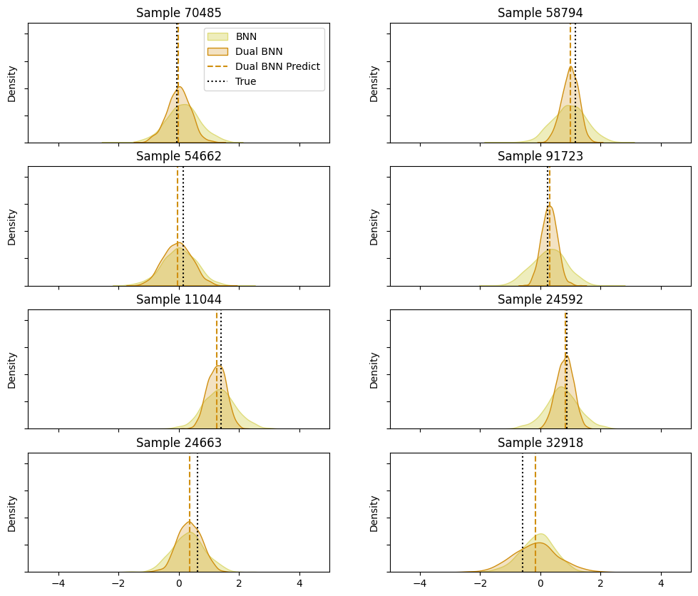
    


The density plots for individual samples illustrate that both the simple Bayesian neural network (BNN) and the Two Heads Bayesian neural network (Dual BNN) provide accurate predictions. However, the Dual BNN offers the additional benefit of varying uncertainty estimates, making it more informative in terms of prediction confidence. The BNN, while still effective, provides more consistent uncertainty estimates, potentially limiting its utility in scenarios where understanding prediction confidence is crucial.

Notice how the Two Heads network (orange) varies its uncertainty estimates, unlike the model which doesn't estimate uncertainty (yellow). For example, in samples 24592, 91723, and 11044, the Two Heads network is much more certain of its estimate than the other model, showing a high peak with a much sharper curve around the predicted mean for the distribution in orange. On the other hand, samples 54662, 24663, and 32918 show less certain estimates, and the predictive distribution is wider. Sometimes both models have similar levels of uncertainty, like in samples 54662 and 32918.
